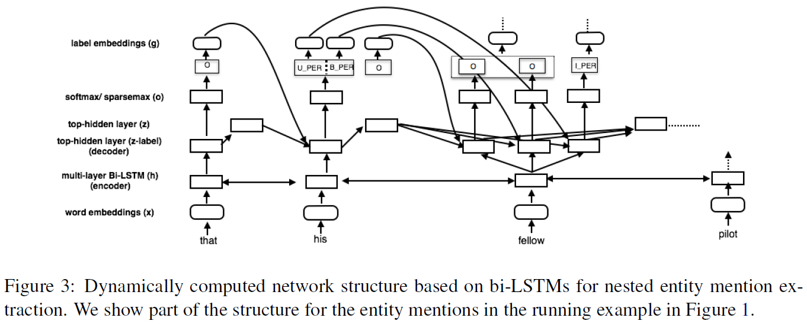
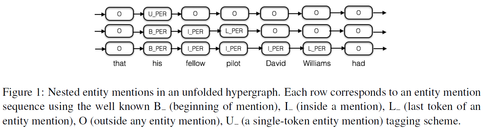
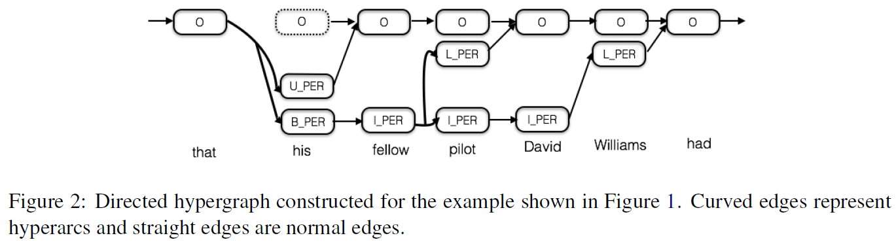
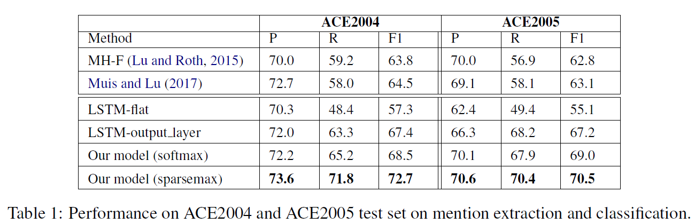

# Nested Named Entity Recognition Revisited
## Information
- 2018 NAACL
- Arzoo Katiyar and Claire Cardie

## Keywords
- NER
- Nested NER

## Contribution
- Propose a novel recurrent neural network based approach to simultaneously handle nested named entity recognition and nested entity mention detection.

## Summary
- The model learns a hypergraph representation for nested entities using features extracted from a recurrent neural network.

1. Entity Extraction:
	- Encode input sequence by multi-layer bi-LSTM into hidden state, and use it to predict entity
	- Use multi-label training objective to train entity extraction
2. Hypergraph Construction:
	- The unfolded hypergraph:
		
	- Construct a single hypergraph:
		This is accomplished by collapsing the shared states (labels) in the output entity label sequences into a single state
		

- Results:
	

## Source Code
not found