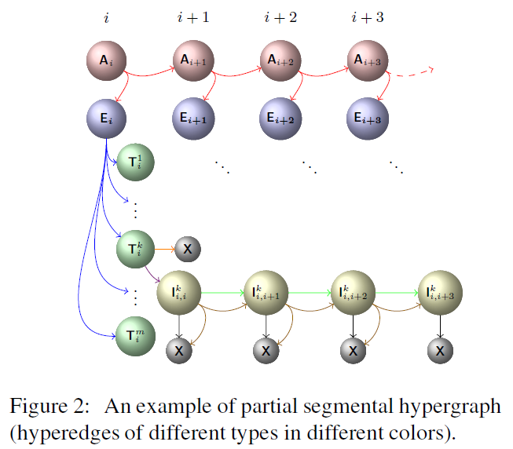
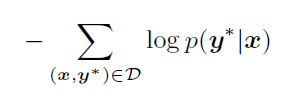
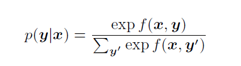
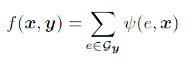
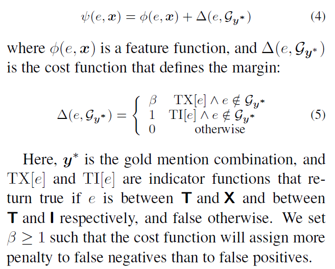
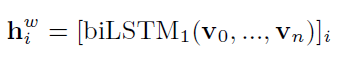
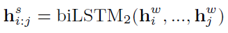
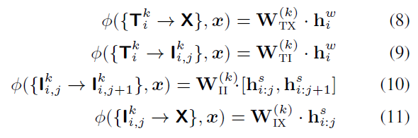
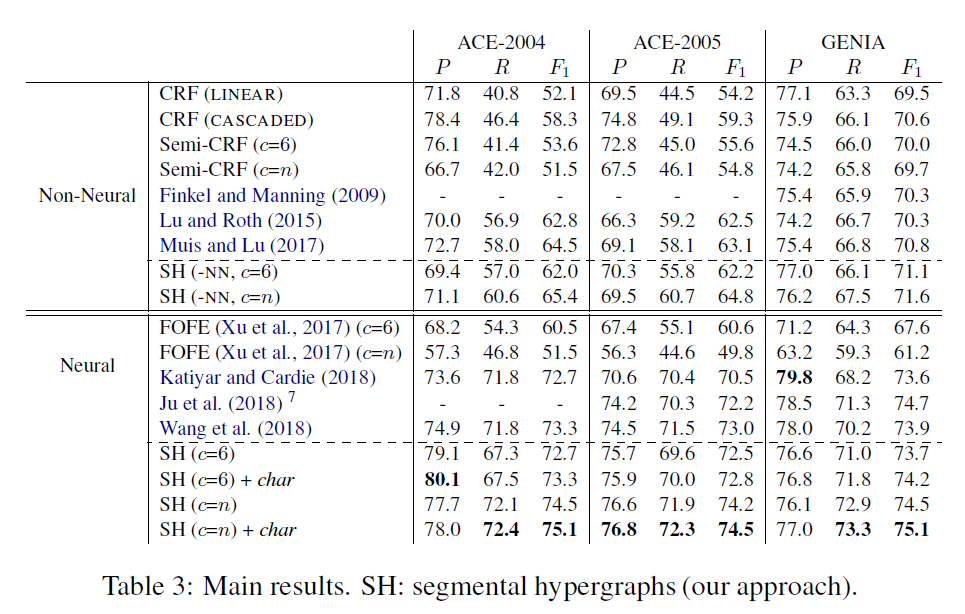

# Neural Segmental Hypergraphs for Overlapping Mention Recognition
## Information
- 2018 EMNLP
- Bailin Wang and Wei Lu

## Keywords
- NER
- Mention Recognition
- Overlapping Mention(Entity)

## Contribution
- Propose a novel segmental hypergraph representation that is capable of modeling arbitrary combinations of (potentially overlapping) mentions in a given sentence.

## Summary
- Propose a hypergraph representation to handle the overlapping mentions in sentences.

1. The Hypergraph Representation:
	
	- Symbols:
		- Ai : encodes all such mentions that start with the i-th or a later word
		- Ei : encodes all mentions that start exactly with the i-th word
		- Tik : represents all mentions of type k starting with the i-th word
		- Ii,jk : represents all mentions of type k that contain the j-th word and start with the i-th word
		- X : marks the end of a mention
2. Learn the Probability of Each Hyperpath:
	- Objective : Negative log likelihood of all instances in the training set D
		
	- Probability of Each Hyperpath:
		
	- Score Function:
		
		, where e is hyperedge and x is input sentence
		
	- Feature Function:
		- Use two bidirectional LSTMs to learn word level and span level feature representations that can be used in feature function.
		- The representation for i-th word vi is the concatenation of pre-trained word embedding ei and POS tag to its embedding pi
		- Word level feature representations:
			
		- Span level feature representations:
			
		- Feature Function: use a linear layer to compute
			

- Results:
	
 

## Source Code
- [Overlapping NER](https://github.com/berlino/overlapping-ner-em18)
