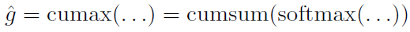

# Ordered Neurons: Integrating Tree Structures into Recurrent Neural Networks(ON-LSTM)
## Information
- 2019 ICLR
- Yikang Shen, Shawn Tan, Alessandro Sordoni, Aaron Courville

## Keywords
- NLU
- RNN
- Constituency Paese Tree

## Contribution
- Propose to add such an inductive bias by ordering the neurons; a vector of master input and forget gates ensures that when a given neuron is updated, all the neurons that follow it in the ordering are also updated.
- The novel recurrent architecture, ordered neurons LSTM (ON-LSTM), achieves good performance on four different tasks: language modeling, unsupervised parsing, targeted syntactic evaluation, and logical inference.

## Summary
- Introduce ordered neurons, a new inductive bias for recurrent neural networks, which promotes differentiation of the life cycle of information stored inside each neuron:
	1. High-ranking neurons will store long-term information which is kept for a large number of steps.
	2. Low-ranking neurons will store short-term information that can be rapidly forgotten.
	- To avoid a strict division between high-ranking and low-ranking neurons, this paper proposes a new activation function, the cumulative softmax, or cumax(), to actively allocate neurons to store long/short-term information.
	- Use the cumax() function to produce a vector of master input and forget gates ensuring that when a given neuron is updated (erased), all of the neurons that follow it in the ordering are also updated(erased).
- Based on the cumax() and the LSTM architecture, this paper has designed a new model, ON-LSTM, that is biased towards performing tree-like composition operations.

- Model Structure:
	
	- Given a sequence of tokens S = (x1,...,xT) and its corresponding constituency tree, the goal is to infer the unobserved tree structure while processing the observed sequence, i.e. while computing the hidden state ht for each time step t.
	- At each time step, ht would ideally contain a information about all the nodes on the path between the current leaf node xt and the root S.
	- The differentiation between high-ranking and low-ranking neurons is learnt in a completely data-driven fashion by controlling the update frequency of single neurons: 
		- To erase (or update) high-ranking neurons, the model should first erase (or update) all lower-ranking neurons. In other words, some neurons always update more (or less) frequently than the others, and that order is pre-determined as part of the model architecture.
	- ON-LSTM ("ordered neurons LSTM"):
		- The standard LSTM:
			- 
		- The difference with the LSTM is that we replace the update function for the cell state ct with a new function.
		1. Activation Function: cumax()
			- To enforce an order to the update frequency, introduce a new activation function:
				-
				,where cumsum denotes the cumulative sum.
				- The vector ^g can be seen as the expectation of a binary gate g = (0,...,0,1,...,1).
					- This binary gate splits the cell state into two segments: the 0-segment and the 1-segment. Thus, the model can apply different update rules on the two segments to differentiate long/short-term information.
				- Denote by **d** a categorical random variable representing the index for the first "1" in g:
					- p(d) = softmax(...)
					- The variable d represents the split point between the two segments.
					- Compute the probability of the k-th value in g being "1" by evaluating the probability of the disjunction of any of the values before the k-th being the split point.
					- Since the categories are mutually exclusive, we can do this by computing the cumulative distribution function:
						-
			- Use a continuous relaxation by computing the quantity p(d <= k), obtained by taking a cumulative sum of the softmax. As gk is binary, this is equivalent to computing E[gk]. Hence, ^g = E[g].
		2. Structured Gating Mechanism:
			- Introduce a master forget gate and a master input gate:
				- 
			- Using the master gates, define a new update rule:
				- 
				- The master forget gate controls the erasing behavior of the model
					- In a parse tree, this operation is akin to closing previous constituents.
					- A large number of zeroed neurons represents the end of a high-level constituent in the parse tree, as most of the information in the state will be discarded.
					- A small number of zeroed neurons represents the end of a low-level constituent as high-level information is kept for further processing.
				- The master input gate is meant to control the writing mechanism of the model
					- A large number of zeroed neurons means that the current input xt contains long-term information that needs to be preserved for several time steps.
					- A small number of zeroed neurons means that the current input xt just provides local information that could be erased by the master forget gate in the next few time steps.
				- The product of the two master gates represents the overlap of both master gate.
					- Whenever an overlap exists, the corresponding segment of neurons encodes the incomplete constituents that contain some previous words and the current input word xt.
			- As the master gates only focus on coarse-grained control, modeling them with the same dimensions as the hidden states is computationally expensive and unnecessary.
				- Set the master gate to be Dm = D/C dimensional vectors, where D is the dimension of hidden state, and C is a chunk size factor.
				- repeat each dimension C times, before the element-wise multiplication with ft and it.

- Results:
	- Language Modeling Result:
		
	- Unsupervised Constituency Parsing Result:
		
	- Targeted Syntactic Evaluation Result:
		
	- Logical Inference Result:
		

## Source Code
- [ON-LSTM](https://github.com/yikangshen/Ordered-Neurons)