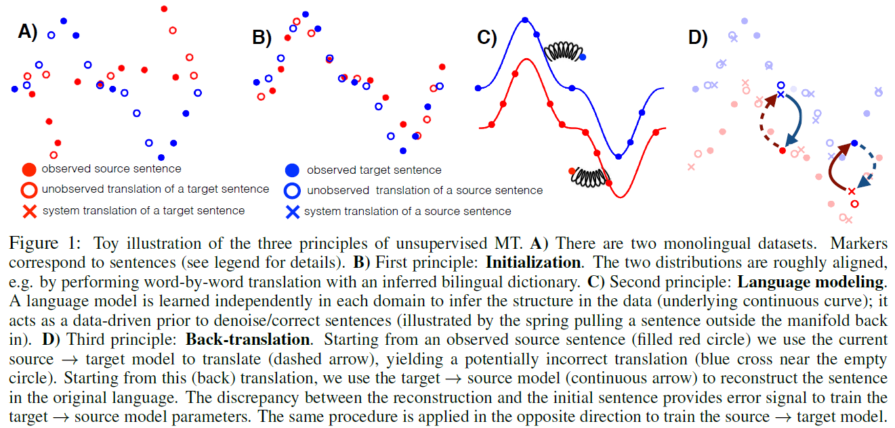
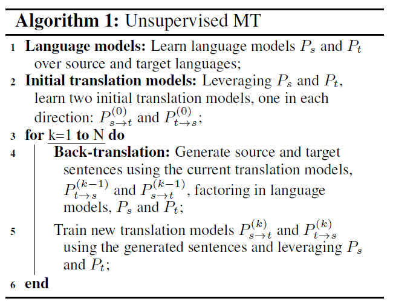
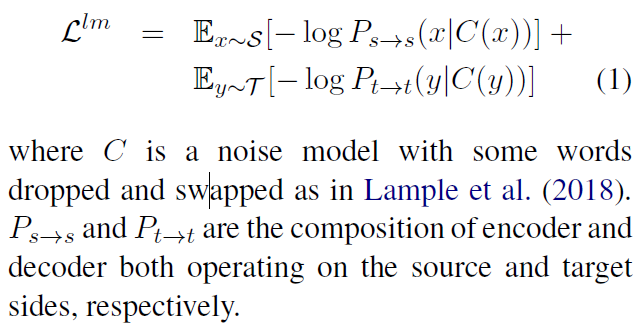
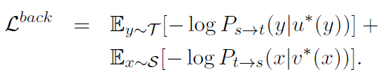
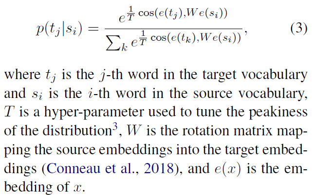
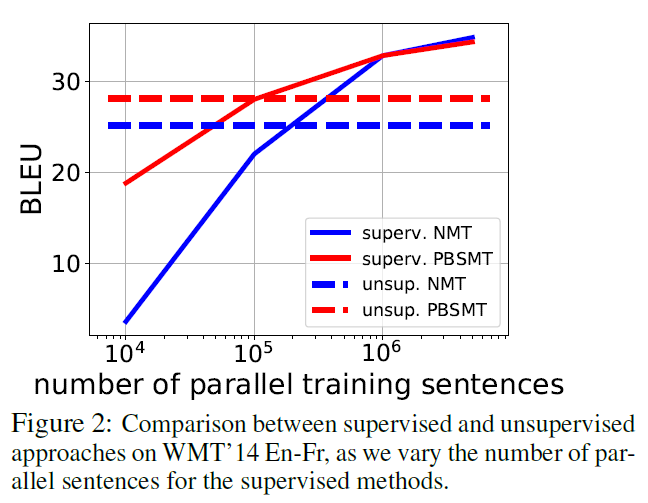
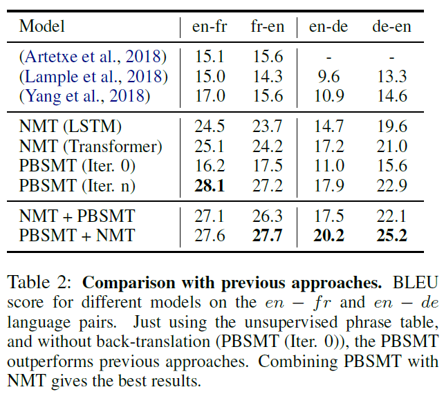

# Phrase-Based & Neural Unsupervised Machine Translation
## Information
- 2018 EMNLP
- Lample, Guillaume, et al.

## Keywords
- Unsupervised Learning
- Machine Translation

## Contribution
- Combines two previous neural approaches ([Lample et al., 2018](Unsupervised_Machine_Translation_Using_Monolingual_Corpora_Only.md); [Artetxe et al., 2018](https://arxiv.org/abs/1710.11041)), simplifying the architecture and loss function while still following the above mentioned principles(Initialization, Language Modeling, Iterative Back-translation).
- Apply the same ideas and methodology to a traditional phrase-based statistical machine translation (PBSMT) system.

## Summary
- Propose two model variants, a neural and a phrase-based model.
- Both versions leverage a careful initialization of the parameters, the denoising effect of language models and automatic generation of parallel data by iterative back-translation.

- Principles of Unsupervised MT
	
	1. Initialization:
		- Initialization of the translation models
	2. Language Modeling
		- Given large amounts of monolingual data, train language models on both source and target languages.
	3. Iterative Back-translation
		- The goal of this model is to generate a source sentence for each target sentence in the monolingual corpus.
		- This turns the daunting unsupervised problem into a supervised learning task, albeit with noisy source sentences.

- Unsupervised MT systems:
	
	1. Unsupervised NMT:
		- Initialization:
			- Consider byte-pair encodings(BPE)
				- Advantages:
					1. Reduce the vocabulary size and they eliminate the presence of unknown words in the output translation.
					2. Instead of learning an explicit mapping between BPEs in the source and target languages, define BPE tokens by jointly processing both monolingual corpora. **If languages are related**, they will naturally share a good fraction of BPE tokens, which eliminates the need to infer a bilingual dictionary.
				- Steps:
					1. Join the monolingual corpora
					2. Apply BPE tokenization on the resulting corpus
					3. Learn token embeddings on the same corpus
					4. Used to initialize the lookup tables in the encoder and decoder
		- Language Modeling:
			
			- Language modeling is accomplished via denoising autoencoding.
		- Back-translation:
			- The pairs (u\*(y); y) and (x; v\*(x))) constitute automatically-generated parallel sentences which, following the back-translation principle, can be used to train the two MT models by minimizing the following loss:
			
		- Objective Function:
			- Objective function minimized at every iteration of SGD is Llm + Lback
		- Sharing Latent Representations:
			- To prevent the model from cheating by using different subspaces for the language modeling and translation tasks, add an additional constraint.
			- Share all encoder parameters across the two languages.
				- Ensure that the benefits of language modeling nicely transfer to translation from noisy sources and eventually help the NMT model to translate more fluently.
			- Share all decoder parameters:
				- Simply induces useful regularization.
	2. Unsupervised PBSMT:
		- Using a Phrase-Based Statistical Machine Translation (PBSMT) system [paper](https://www.aclweb.org/anthology/N03-1017) as the underlying backbone model.
		- Initialization:
			- Populate the initial phrase tables(from source to target and from target to source) using an inferred bilingual dictionary built from monolingual corpora using the method proposed by [Conneau et al. (2018)](Word_Translation_Without_Parallel_Data.md).
			
		- Language Modeling:
			- Learn smoothed n-gram language models using KenLM [Heafield, 2011](https://kheafield.com/papers/avenue/kenlm.pdf).
		- Back-translation:
			- Use the unsupervised phrase tables and the language model on the target side to construct a seed PBSMT.
			- Use this model to translate the source monolingual corpus into the target language.
			- Once the data has been generated, we train a PBSMT in supervised mode to map the generated data back to the original source sentences.
			- Repeat Back-translation steps.

- Results:
	- Comparison between supervised and unsupervised approaches:
		- 
	- Comparison with previous approaches:
		- 

## Source Code
- [UnsupervisedMT](https://github.com/facebookresearch/UnsupervisedMT)