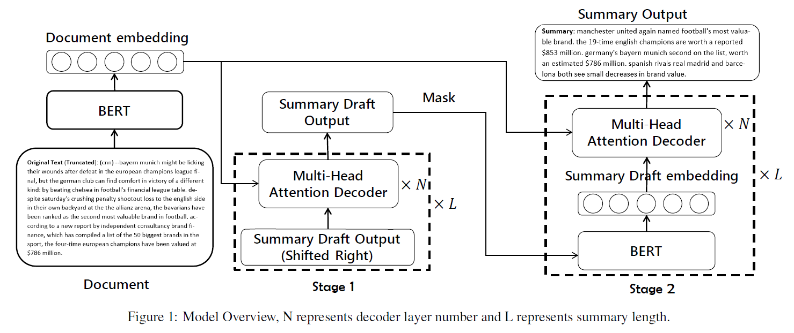
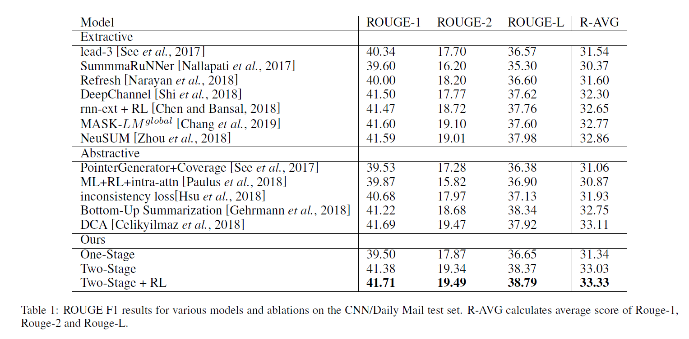
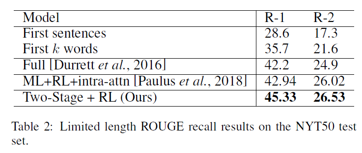

# Pretraining-Based Natural Language Generation for Text Summarization
## Information
- 2019 Arxiv
- Zhang, Haoyu, et al.

## Keywords
- NLG
- Text Summarization
- Pre-train
- BERT

## Contribution
- Propose a natural language generation model based on BERT, and the model can be trained end-to-end without handcrafted features.
- Design a two-stage decoder process that can generate each word of the summary considering both sides' context information

## Summary

1. Context Embedding Encoder:
 Use BERT as the encoder. It first maps the input sequence to word embeddings and then computes document embeddings as the encoder's output
2. Summary Draft Decoder:
	- N layer Transformer decoder : Introduce an N layer Transformer decoder to learn the conditional probability P(A|H).
	- Copy Mechanism : As some summary tokens are out-of-vocabulary words and occurs in input document, we incorporate copy mechanism
	- Reason not use BERT hear: as the input sequence of the decoder is not complete, we do not use the BERT network to predict the context vectors here.
3. Summary Refine Decoder:
 The main reason to introduce the refine process is to enhance the decoder using BERT contextualized representations.
	- BERT : Masks each word in the summary draft(from last step) one by one, then feeds the draft to BERT(reuse the BERT in encoder) to generate context vectors.
	- N layer Transformer decoder : Predicts a refined summary word using an N layer Transformer decoder which is the same as the draft decoder.
	- Mixed Objective:
		Optimize the mixed objective by introducing the Policy Gradient Method. 
		- Maximum-likelihood Objective : Let the model to generate readable sequences.
		- ROUGE-L : A discrete objective that meet the evaluation metric.
- Others:
	- Train time : Jointly train both decoder using "teacher-forcing" algorithm. During training we feed the ground-truth summary to each decoder and minimize the objective
	- Test time : Each time step we choose the predicted word by ^y = argmaxy'P(y'|x), use **beam search** to generate the draft summaries, and use **greedy search** to generate the refined summaries

## Source Code
not found