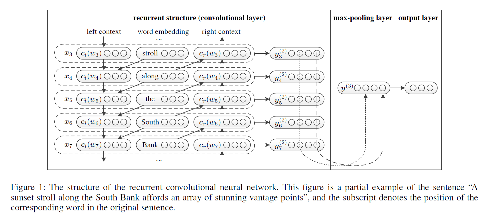
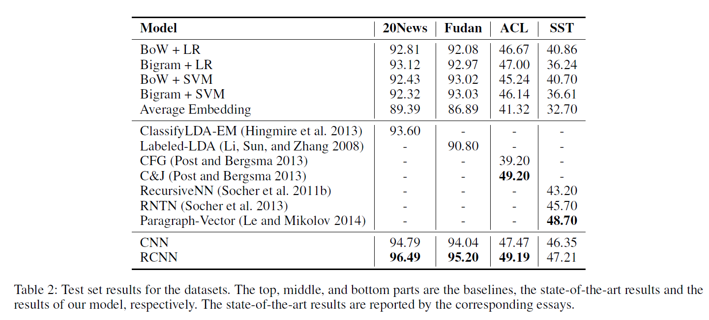

# Recurrent Convolutional Neural Networks for Text Classification
## Information
- 2015 AAAI
- Siwei Lai, Liheng Xu, Kang Liu, Jun Zhao

## Keywords
- Recurrent Convolutional Neural Networks(RCNN)
- Text Classification

## Contribution
- Apply RNN + Max-pooling to the text classification
- Utilize the advantage of both RNN and CNN
 - RNN : Better disambiguate the meaning of the word compared to conventional neural models that only use a fixed window
 - CNN : Find the most important latent semantic factors in the document

## Summary
1. Use a bidirection RNN to encode the input text
2. Apply Max-pooling to step1 RNN of each step output, attempting to find the most important latent semantic factors in the document

## Source Code
- [RCNN for Text Classification](https://github.com/roomylee/rcnn-text-classification)