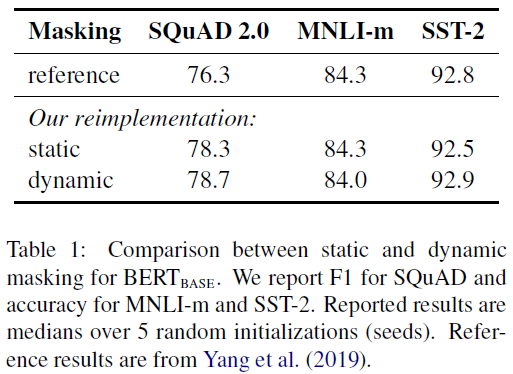
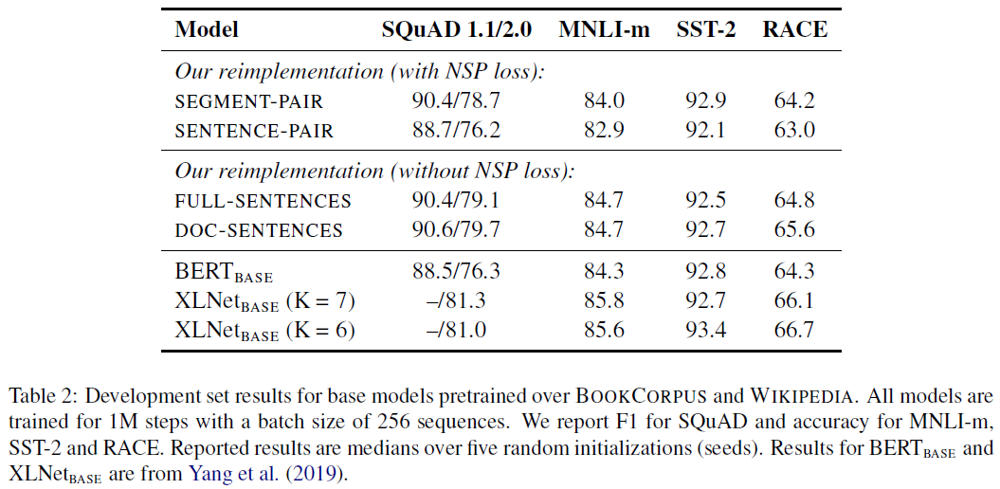
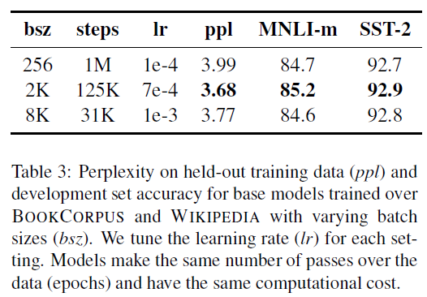
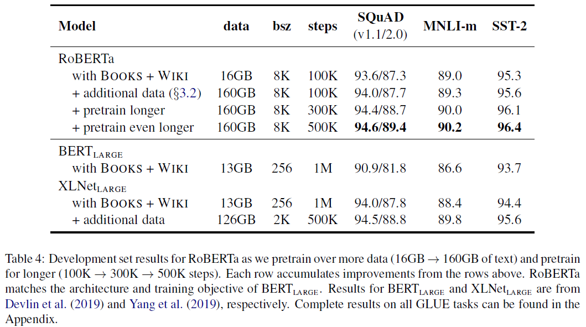
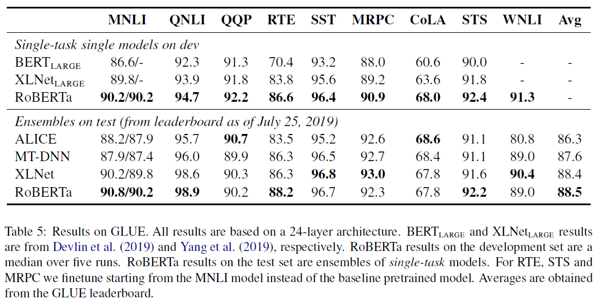
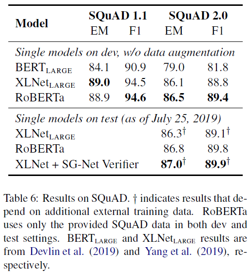
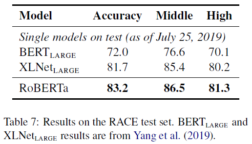

# RoBERTa: A Robustly Optimized BERT Pretraining Approach (RoBERTa)
## Information
- 2019 arXiv
- Liu, Yinhan, et al.

## Keywords
- NLU
- Pre-train
- BERT

## Contribution
- Present a set of important BERT design choices and training strategies and introduce alternatives that lead to better downstream task performance.
- Use a novel dataset, CC-NEWS, and confirm that using more data for pretraining further improves performance on downstream tasks.
- Show that masked language model pretraining, under the right design choices, is competitive with all other recently published methods.

## Summary
- Present a replication study of BERT pretraining ([Devlin et al., 2019](https://arxiv.org/abs/1810.04805)) that carefully measures the impact of many key hyperparameters and training data size.

- Training Procedure Analysis
	1. Static vs. Dynamic Masking
		- 
		1. Static Masking:
			- The original BERT implementation performed masking once during data preprocessing, resulting in a single static mask.
			- To avoid using the same mask for each training instance in every epoch, training data was duplicated 10 times so that each sequence is masked in 10 different ways over the 40 epochs of training.
		2. Dynamic Masking:
			- Generate the masking pattern every time we feed a sequence to the model.
	2. Model Input Format and Next Sentence Prediction
		- 
		1. SEGMENT-PAIR+NSP:
			- This follows the original input format used in BERT with the NSP loss.
			- Each input has a pair of segments, which can each contain multiple natural sentences, but the total combined length must be less than 512 tokens.
		2. SENTENCE-PAIR+NSP:
			- Each input contains a pair of natural sentences, either sampled from a contiguous portion of one document or from separate documents.
			- Increase the batch size so that the total number of tokens remains similar to SEGMENT-PAIR+NSP.
			- Retain the NSP loss.
		3. FULL-SENTENCES:
			- Each input is packed with full sentences sampled contiguously from one or more documents, such that the total length is at most 512 tokens.
			- Inputs may cross document boundaries.
			- Remove the NSP loss.
		4. DOC-SENTENCES:
			- Inputs are constructed similarly to FULL-SENTENCES, except that they may not cross document boundaries.
			- Dynamically increase the batch size in these cases to achieve a similar number of total tokens as FULL-SENTENCES.
			- Remove the NSP loss.
		- Conclusions:
			- Using individual sentences hurts performance on downstream tasks(from SEGMENT-PAIR+NSP v.s. SENTENCE-PAIR+NSP).
			- Removing the NSP loss matches or slightly improves downstream task performance(from SEGMENT-PAIR+NSP v.s. FULL-SENTENCES).
			- Restricting sequences to come from a single document performs slightly better than packing sequences from multiple documents(from FULL-SENTENCES v.s. DOC-SENTENCES).
	3. Training with large batches
		- 
		- Observe that training with large batches improves perplexity for the masked language modeling objective, as well as end-task accuracy.
	4. Text Encoding
		1. Character-level BPE:
			- The original BERT implementation uses a character-level BPE vocabulary of size 30K, which is learned after preprocessing the input with heuristic tokenization rules.
		2. Byte-level BPE:
			- Consider training BERT with a larger byte-level BPE vocabulary containing 50K subword units, without any additional preprocessing or tokenization of the input.([Radford et al. (2019)](https://www.techbooky.com/wp-content/uploads/2019/02/Better-Language-Models-and-Their-Implications.pdf))
		- Early experiments revealed only slight differences between these encodings(Byte-level BPE achieving slightly worse end-task performance on some tasks).
		- Consider the advantages of a universal encoding scheme outweighs the minor degredation in performance.

- RoBERTa(**R**obustly **o**ptimized **BERT** **a**pproach)
	- Training Procedures:
		- Dynamic Masking
		- FULL-SENTENCES without NSP loss
		- Large mini-batches
		- A larger byte-level BPE
	- Other Factors:
		- The data used for pretraining(data size).
		- The number of training passes through the data(training steps).

- Experiments:
	- Development set results for RoBERTa:
		- 
	- Results on GLUE:
		- 
	- Results on SQuAD:
		- 
	- Results on RACE:
		- 

## Source Code
- [RoBERTa](https://github.com/pytorch/fairseq/blob/master/examples/roberta/README.md)
