# RotatE: Knowledge Graph Embedding by Relational Rotation in Complex Space(RotatE)
## Information
- 2019 ICLR
- Sun, Zhiqing, et al.

## Keywords
- Knowledge Graph
- Knowledge Representation
- Knowledge Graph completion(Link Prediction)

## Contribution
- Present a new approach for knowledge graph embedding called **RotatE**, which is able to model and infer various relation patterns including: symmetry/antisymmetry, inversion, and composition.
- Propose a novel self-adversarial negative sampling technique for efficiently and effectively training the RotatE model.

## Summary
- RotatE model maps the entities and relations to the complex vector space and defines each relation as a rotation from the source entity to the target entity. Such a simple operation can effectively model all the three relation patterns: symmetric/antisymmetric, inversion, and composition.

- Relation Types:
	1. Symmetric (Antisymmetric):
		- 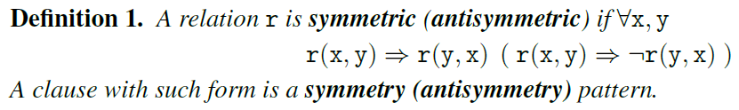
	2. Inverse:
		- 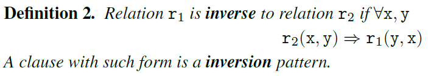
	3. Composed:
		- 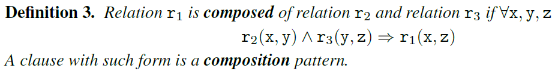
	- Analysis of existing models on their abilities in inferring and modeling these patterns:
		- 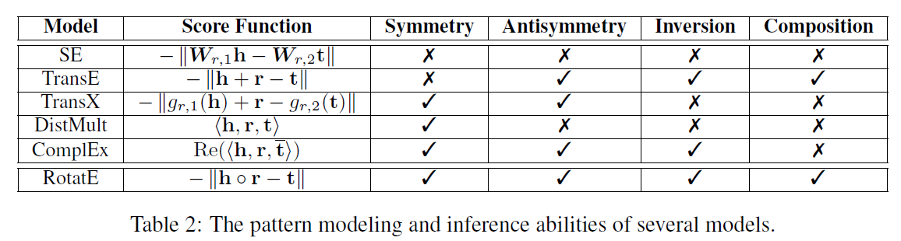

- RotatE:
	- Map the head and tail entities h,t to the complex embeddings.
	- Define the functional mapping induced by each relation r as an element-wise rotation from the head entity h to the tail entity t. 
	- Given a triple (h, r, t), expect that:
		- 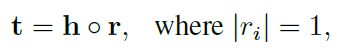
		, where ∘ is the Hadmard (or element-wise) product.
	- Distance function of RotatE:
		- 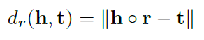
		- Compare to existed models:
			- 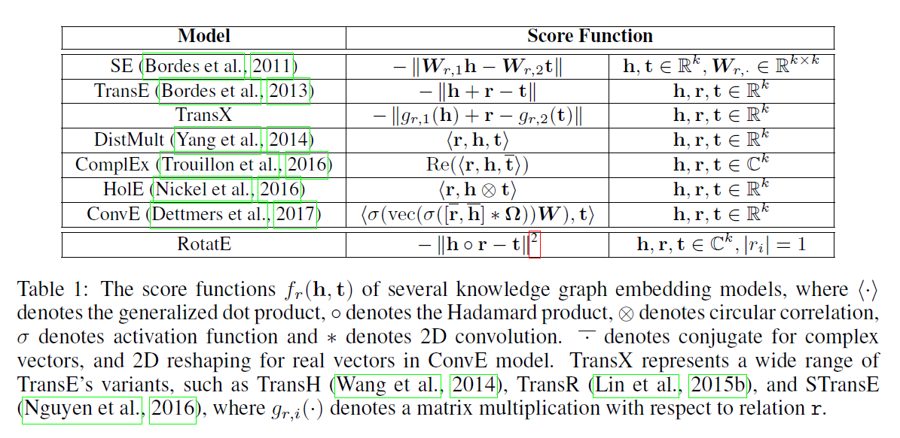
			- These approaches mainly focus on explicitly modeling the relational paths while RotatE model implicitly learns the relation patterns, which is not only much more scalable but also provides meaningful embeddings for both entities and relations.
	- Connection to TransE:
		- 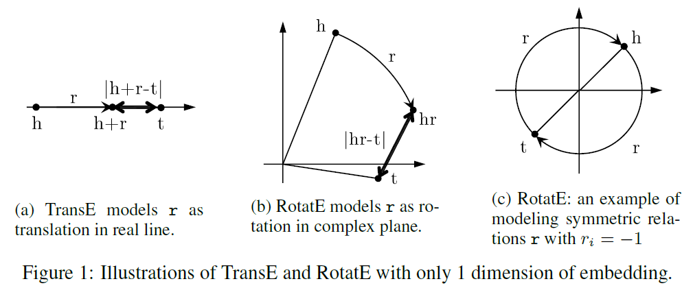
		- TransE is able to infer and model all the other relation patterns except the symmetry pattern. The reason is that in TransE, any symmetric relation will be represented by a 0 translation vector.
		- RotatE solves this problem and is a able to model and infer the symmetry pattern.
- Self-adversarial negative sampling technique:
	- Origin Negative Sampling Loss:
		- 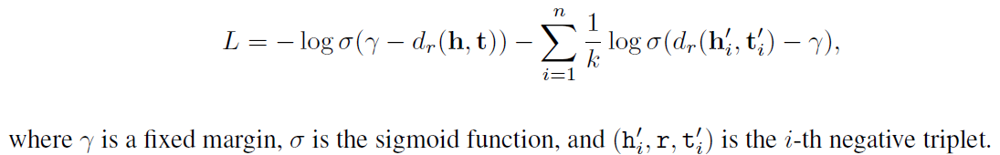
		- Such a uniform negative sampling suffers the problem of inefficiency since many samples are obviously false as training goes on, which does not provide any meaningful information.
	- Self-adversarial Negative Sampling Loss:
		- 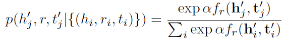
		, where α is the temperature of sampling.
		- The weight of the negative sample:
			- 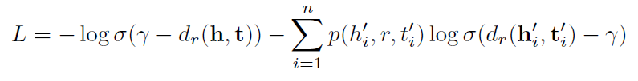

- Results:
	- Results on FB15K and WN18 datasets:
		- 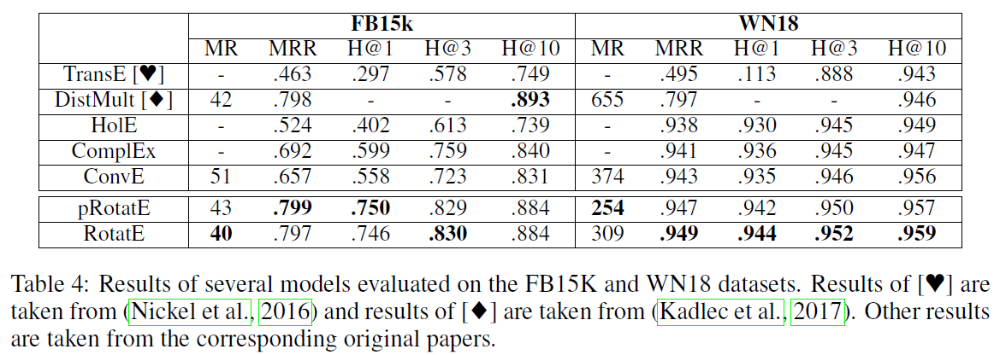
	- Results on FB15k-237 and WN18RR datasets:
		- 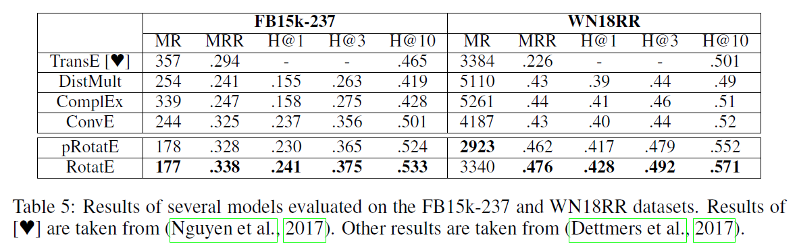
	- Results on the Countries datasets:
		- 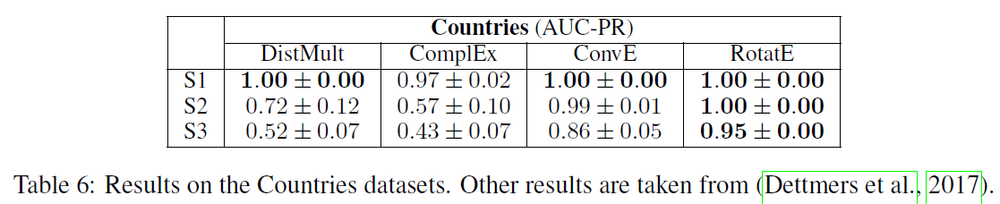
	- Results of TransE with different negative sampling techniques:
		- 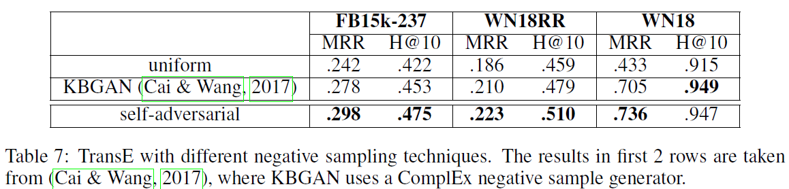
	- Results of TransE and ComplEx with self-adversarial sampling and negative sampling loss:
		- 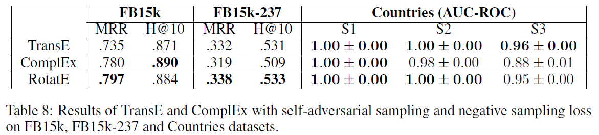

## Source Code
- [RotatE](https://github.com/DeepGraphLearning/KnowledgeGraphEmbedding)