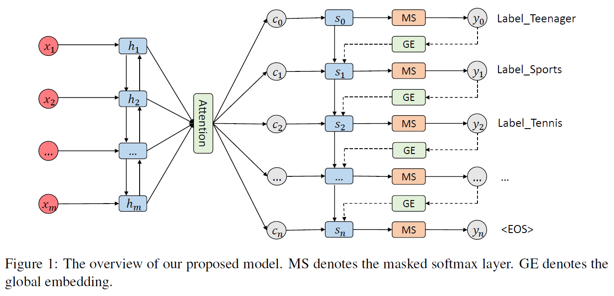
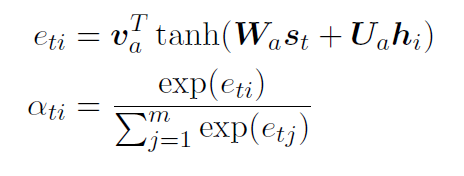
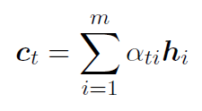
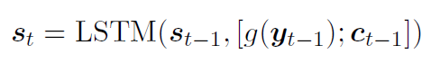
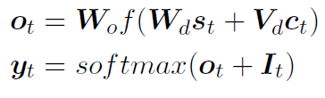
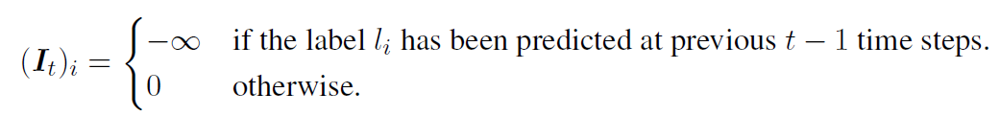
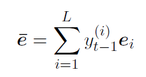
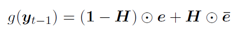
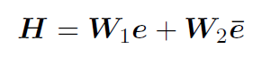
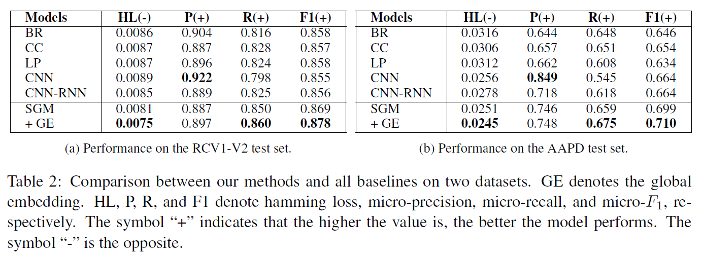

# SGM: Sequence Generation Model for Multi-label Classification
## Information
- 2018 COLING
- Yang, Pengcheng, et al.

## Keywords
- Multi-label Classification
- Text Classification

## Contribution
- Propose to view the Multi-label Classification(MLC) task as a sequence generation problem to take the correlations between labels into account.
- Propose a sequence generation model with a novel decoder structure, which not only captures the correlations between labels, but also selects the most informative words automatically when predicting different labels.

## Summary
- Propose to view the multi-label classification task as a sequence generation problem, and apply a sequence generation model with a novel decoder structure to solve it.
- The decoder uses an LSTM to generate labels sequentially, and predicts the next label based on its previously predicted labels. Therefore, the proposed model can consider the correlations between labels by processing label sequence dependencies through the LSTM structure.
- Novel decoder structure with global embedding is proposed to further improve the performance of the model by incorporating overall informative signals.

- Model Overview
	
	1. Encoder:
		1. Embed wi to a dense embedding vector xi
		2. Use a bidirectional LSTM to obtain the final hidden representation hi
	2. Attention:
		- When the model predicts different labels, not all text words make the same contribution.
		- The final context vector ct:
			
			
	3. Decoder:
		- The hidden state st of the decoder at time-step t is computed as follows:
			
		- yt is the probability distribution over the label space at time-step t:
			
		- It is the mask vector that is used to prevent the decoder from predicting repeated labels.
			
		- Employ the beam search algorithm to find the top-ranked prediction path at inference time.
		- The prediction paths ending with the eos are added to the candidate path set.

- Global Embedding
	- Let e denotes the embedding of the label which has the highest probability under the distribution yt-1
	- e is the weighted average embedding at time t, which is calculated as follows:
		
	- Global embedding g(yt-1):
		
	- H is the transform gate controlling the proportion of the weighted average embedding:
		
		, where W1, W2 are weight matrices.
	- By considering the probability of every label, the model is capable of reducing damage caused by mispredictions made in the previous time steps.

- Results:
	

## Source Code
- [SGM](https://github.com/lancopku/SGM)