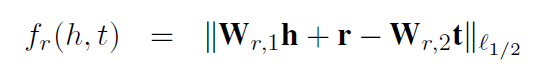
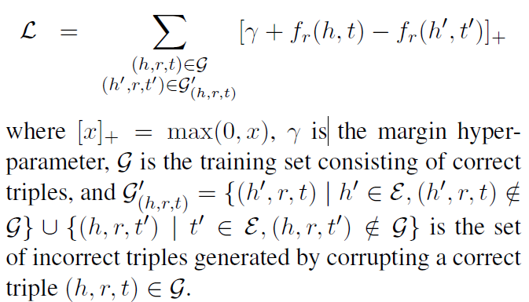
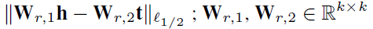
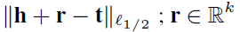
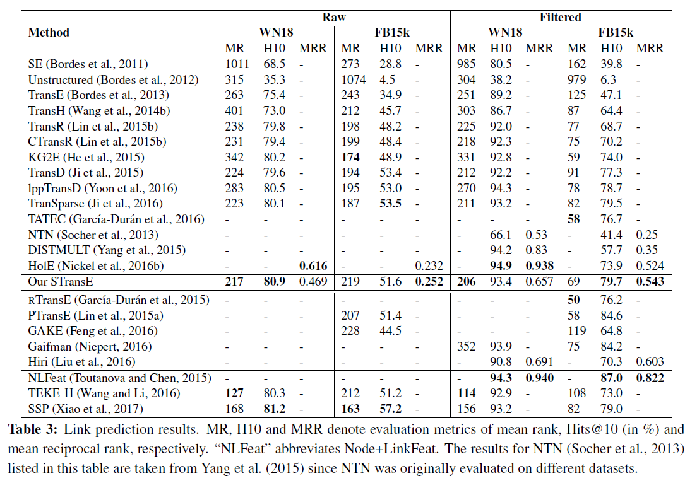

# STransE: a novel embedding model of entities and relationships in knowledge bases(STransE)
## Information
- 2016 NAACL-HLT
- Nguyen, Dat Quoc, et al.

## Keywords
- Knowledge Graph
- Knowledge Representation

## Contribution
- Combine two very simple relation-prediction models, the Structured Embedding(SE) model[Bordes et al., 2011](https://ronan.collobert.com/pub/matos/2011_knowbases_aaai.pdf) and TransE, into a single model, STransE.
- Take both "relation-dependent aspects of both h and t" and "the relationship between h and t in this subspace" into consideration.

## Summary
- Propose a TransE-style relationship holds in some relation-dependent subspace(concept in SE).
- STransE Score Function:
	
- Apply Margin-based Objective Function:
	
- Related Works:
	- The concept of the Structured Embedding(SE) model:
		
	- The concept of TransE:
		

- Link prediction results:
	
	- Experiments Setting:
		1. The first 15 rows report the performance of the models that do not exploit information about alternative paths between head and tail entities.
		2. The next 5 rows report results of the models that exploit information about relation paths.
		3. The last 3 rows present results for the models which make use of textual mentions derived from a large external corpus.

## Source Code
- [STransE](https://github.com/datquocnguyen/STransE)