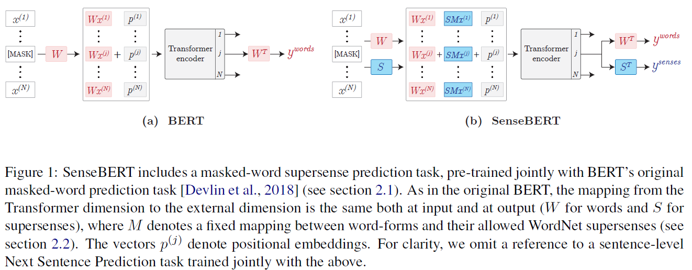
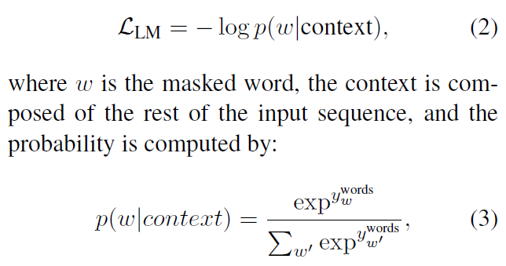
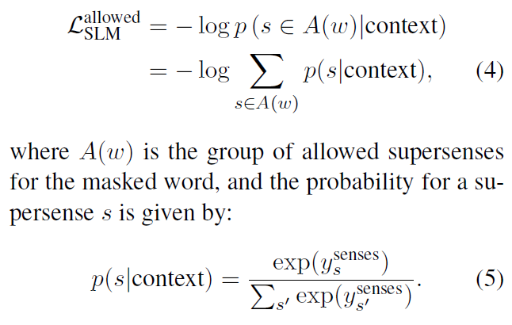
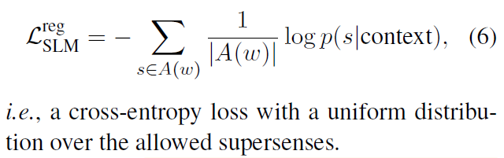
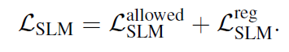
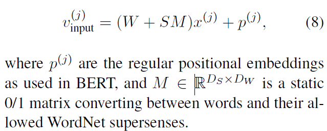
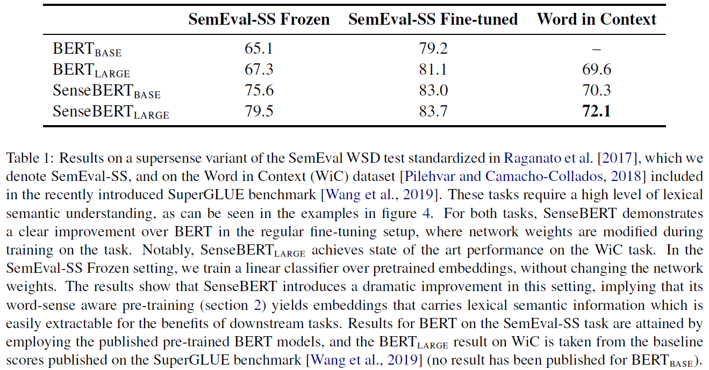
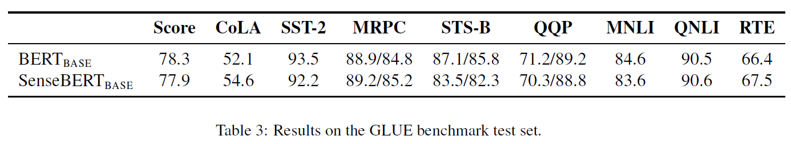

# SenseBERT: Driving Some Sense into BERT (SenseBERT)
## Information
- 2019 arXiv
- Levine, Yoav, et al.

## Keywords
- Word Sense Disambiguation(WSD)
- BERT

## Contribution
- Proposes a method(SenseBERT) to employ self-supervision directly at the word sense level.
- SenseBERT is pre-trained to predict not only the masked words but also their WordNet supersenses.

## Summary
- Jointly with the standard word form level language model, this paper trains a semantic level language model that predicts the missing word's meaning.
- Add a masked-word sense prediction task as an auxiliary task in BERTs pre-training.
	- Employ the masked word's allowed supersenses list from WordNet as a set of possible labels for the sense prediction task.
	- Train the model to predict any of these senses, leading to a simple yet effective soft-labeling scheme.
	- Intuitively, a word's meaning and its context are highly correlated, thus adding the ability to change with context should make the embeddings carry sense information more naturally.

- SenseBERT(Method to incorporate Word-Supersense Information at Pre-training)
	- 
	1. Self-Supervised Supersense Prediction Task
		1. BERT's original masked-word prediction pre-training task
			- 
			, where ywords = WTv(j)output
		2. Sense Pre-training Task
			- Jointly, for every masked word, train the model to predict its supersense.
			- Employ a combination of two loss terms for the supersense-level language model.
			1. Allowed-senses Term
				- Maximizes the probability that the predicted sense is in the set of allowed supersenses of the masked word.
				- 
				- However, treats all the allowed supersenses of the masked word equally will introduce noise to the supersense labels.
					- Expect that aggregating many contexts in a sufficiently large corpus will reinforce the correct labels whereas noisy labels will average out.
			2. Regularization Term
				- Minimizing the Allowed-senses Term loss could result in the network becoming overconfident in predicting a strict subset of the senses.
					- This is especially acute in the early stages of the training procedure, when the network could converge to the noisy signal of the soft-labeling scheme.
				- To mitigate this issue, the regularization term is added to the loss, which encourages a uniform prediction distribution over the allowed supersenses:
				- 
			- For training the semantic level language model, make use of a combined loss of the form:
				- 
	2. Supersense Aware Input Embeddings
		- Insert the newly proposed semantic-level language model matrix S in the input in addition to origin BERT's W
			- 
		- The above strategy allows for the semantic level vectors in S to come into play and shape the input embeddings even for words which are rarely observed in the training corpus.
			- The model adds 30K lower-frequency words to BERT's original 30K-word vocabulary, which contains frequent words.
	3. Single-SupersensedWord Masking
		- Words that have a single supersense are good anchors for obtaining an unambiguous semantic signal.
		- These words help map contexts to supersenses, in a manner that allows the model to make correct context-based predictions even when a masked word has several supersenses.
		- The model therefore favors such words in the masking strategy.

- Experiments:
	- Results on SemEval-SS and Word in Context (WiC) dataset
		- 
	- Result on GLUE benchmark test set.
		- 
		- SenseBERT's result show no significant degradation, and even improvement in some of the tasks.

## Source Code
- not found
