# Simplify the Usage of Lexicon in Chinese NER
## Information
- 2019 arXiv
- Peng, Minlong, et al.

## Keywords
- NER
- Chinese

## Contribution
- Propose a concise but effective method to incorporate the lexicon information into the vector representations of characters.

## Summary
- Propose a concise but effective method to incorporate the lexicon information into the vector representations of characters.
	- The porposed method can avoid introducing a complicated sequence modeling architecture to model the lexicon information.
	- It only needs to subtly adjust the character representation layer of the neural sequence model.

- About Lattice-LSTM (State-of-the-art):
	- Advances
		1. Preserve all possible matching words for each character.
			- Avoid the error propagation introduced by heuristically choosing a matching result of the character to the NER system.
		2. Introduce pre-trained word embeddings to the system.
			- Bing great help to the final performance.
	- Disadvantages
		- Turns the input form of a sentence from a chained sequence into a graph.
			- Greatly increase the computational cost for sentence modeling.

- Design Idea of the Proposed Model:
	- Aim to find a easier way to achieve the idea of Lattice-LSTM, i.e., incorporating all matched words of the sentence to the character-based NER model.
	- Propose to encoding the matched words, obtained from the lexicon, into the representations of characters.
	- Avoid complicated model architecture design.
		- Has much faster inference speed.
		- Be quickly adapted to any appropriate neural architectures without redesign.

- Model Structure:
	- It is a generic character-based neural NER model, which conceptually contains three stacked layers.
	1. Character Representation Layer
		- The input sentence is seen as a character sequence s = {c1, ..., cn}
		- Each character ci is represented using a dense vector and augment the character representation with bigram information by concatenating bigram embeddings with it.
			- 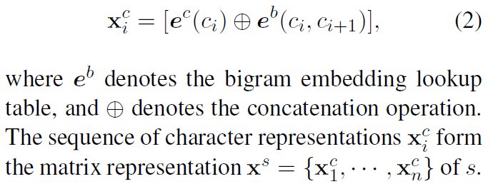
	2. Sequence Modeling Layer
		- The sequence modeling layer models the dependency between characters built on vector representations of the characters.
		- Kinds of layers:
			1. LSTM-based
			2. CNN-based
			3. Transformer-based
	3. Label Inference Layer
		- A sequential conditional random field (CRF) layer is applied to perform label inference for the character sequence.

- Main Proposed Method:
	- Propose to preserving not only the possible segmentation labels of a character but also their corresponding matched words.
	- Each character c of a sentence s corresponds to four word sets marked by the four segmentation labels "BMES".
		1. The word set B(c) consists of all lexicon matched words on s that begin with c.
		2. M(c) consists of all lexicon matched words in the middle of which c occurs.
		3. E(c) consists of all lexicon matched words that end with c.
		4. S(c) is the single-character word comprised of c.
		- And if a word set is empty, add a special word "NONE" to it to indicate this situation.
		- Example:
			- 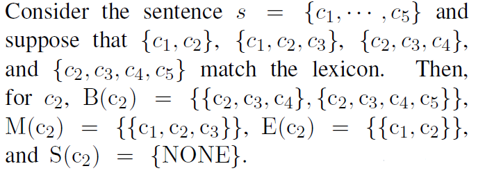
		- Introduce the pre-trained word embeddings and moreover, can exactly restore the matching results from the word sets of each character.
	- Condense the four word sets of each character into a fixed-dimensional vector
		- 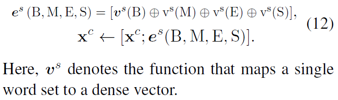
		- Mapping functions that maps each word set into a fixed-dimensional vector.
			1. Mean-pooling algorithm
				- 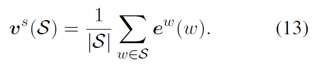
			2. Frequency weighted pooling algorithm
				- Propose to weighing the representation of each word in the word set to get the pooling representation of the word set.
				- propose to using the frequency of the word as an indication of its weight.
				- 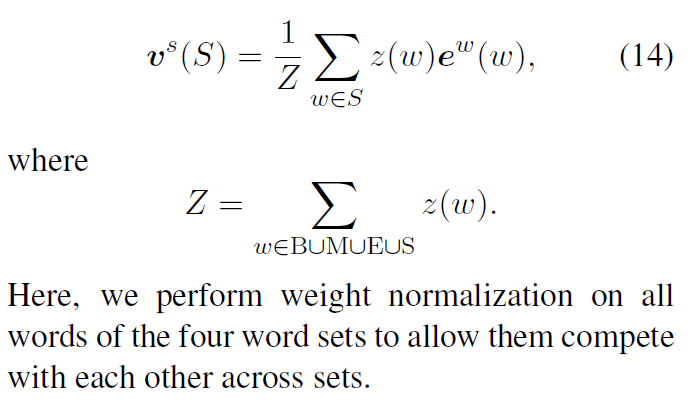
			3. Smoothing frequency weighted pooling algorithm
				- Tried to introducing a smoothing to the weight of each word to increase the weights of infrequent words.
				- 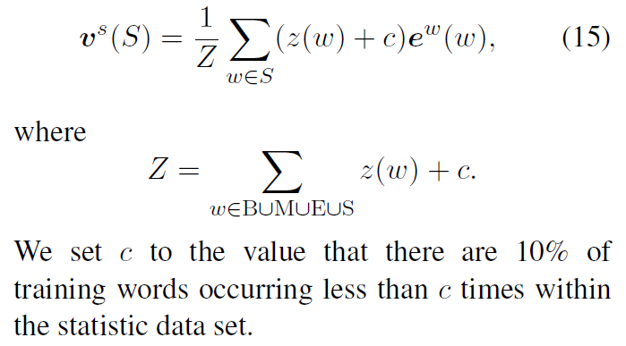

- Experiments:
	- 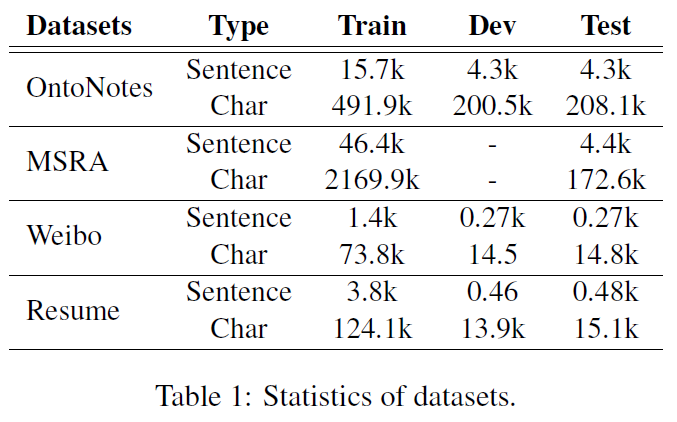
	- Performance Experiments:
		- Performance on OntoNotes:
			- 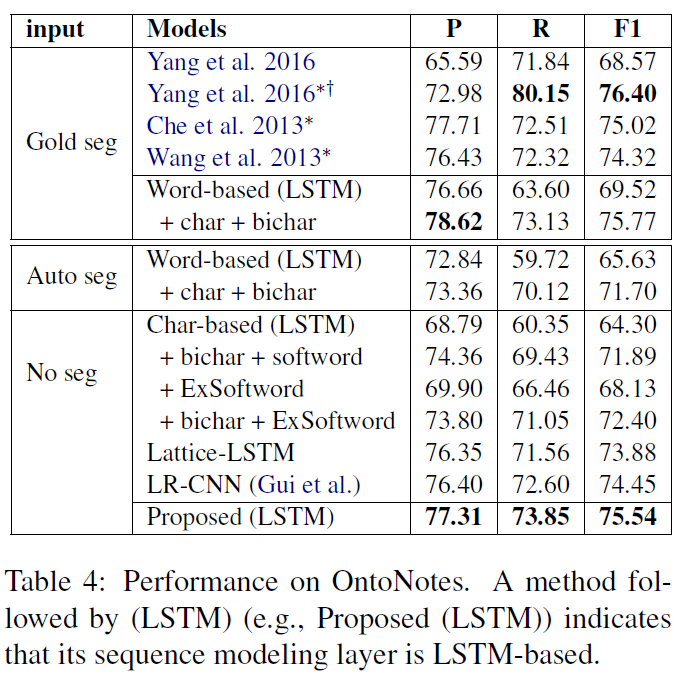
		- Performance on MSRA:
			- 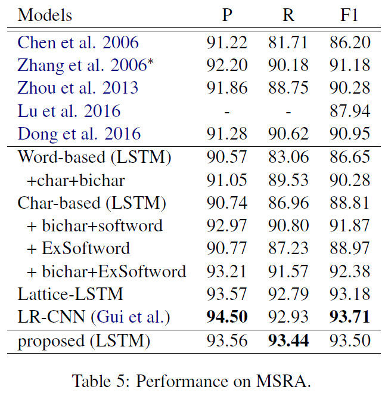
		- Performance on Weibo:
			- 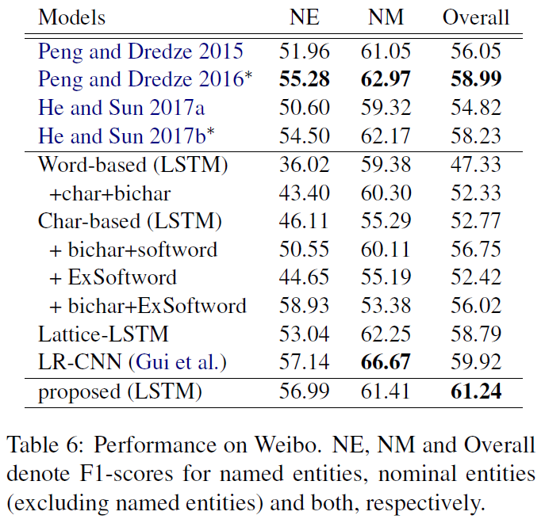
		- Performance on Resume:
			- 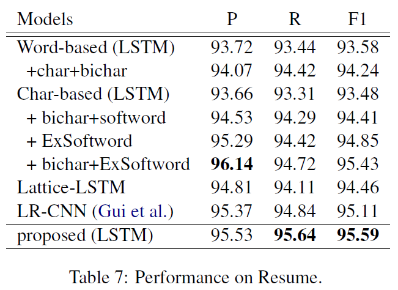
	- Ablation Study:
		- Computational Efficiency Study:
			- 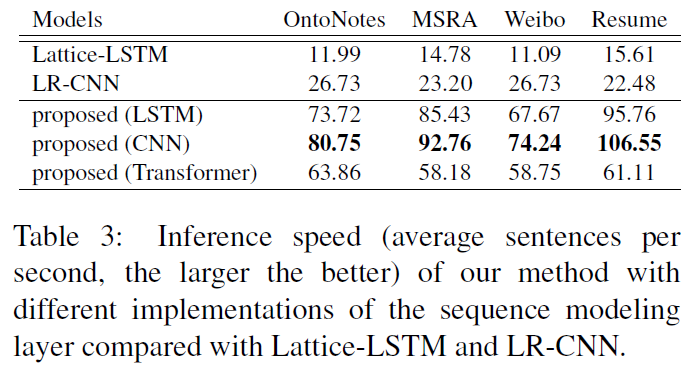
		- Character Representation with or w/o bigram:
			- 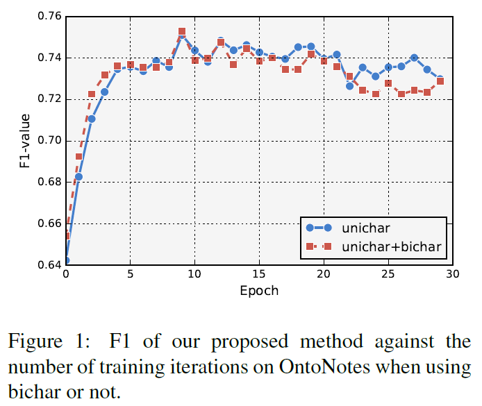
			- Additionally introducing character bigrams cannot bring considerable improvement to our method.
			- A possible explanation of this phenomenon is that the introduced word information by the proposed method has covered the bichar information.
			- In the other experiments, we did not use bichar in our method.
		- Different implementations of Mapping functions:
			- 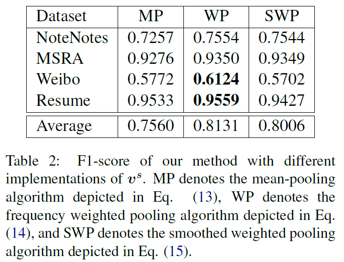
			- The weighted pooling algorithm performs generally better than the other two implementations.
			- In the other experiments, we in default applied the weighted pooling algorithm.
		- Different implementations of the sequence modeling layer:
			- 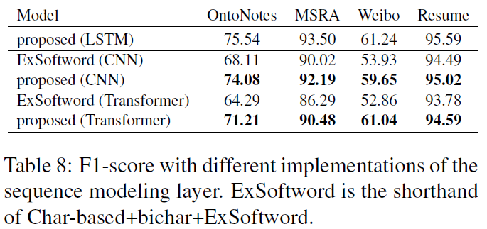

## Source Code
- [LexiconAugmentedNER](https://github.com/v-mipeng/LexiconAugmentedNER)