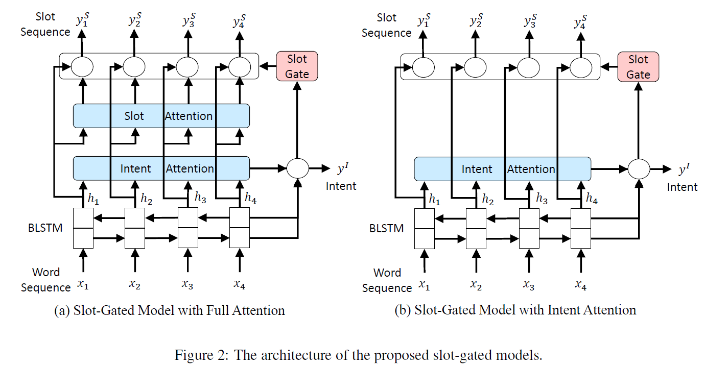
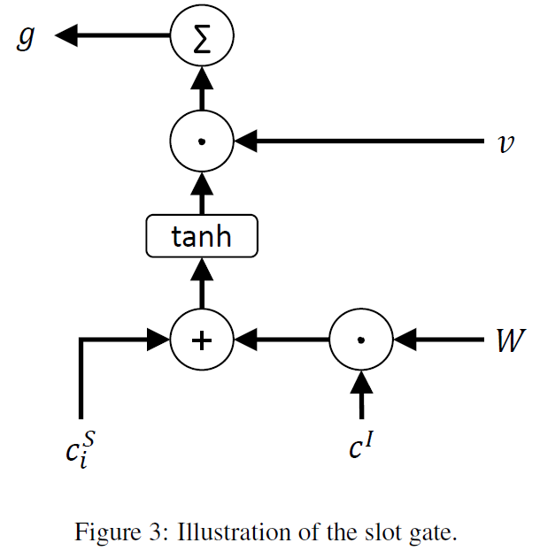
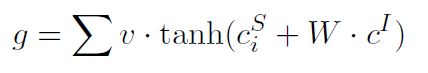
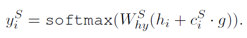
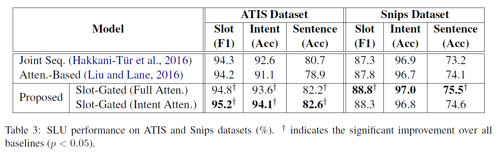

# Slot-Gated Modeling for Joint Slot Filling and Intent Prediction
## Information
- 2018 NAACL-HLT (Short Papers)
- Goo, Chih-Wen, et al.

## Keywords
- NLU
- Intent Detection
- Slot Filling

## Contribution
- The proposed slot-gated approach achieves better performance than the attention-based models.

## Summary
- Propose the **Slot-Gated Mechanism** to learn the relationship between intent and slot attention vectors in order to  obtain better semantic frame results by the global optimization
	
- Slot-Gated Mechanism:
	
	- Slot context vector ciS and intent context vector cI are combined(cI broadcasts in time dimension to have the same shape with ciS) to pass through the slot gate.
		
	- Then, use g to weight between hi and ciS to derive output yiS
		

- Results:
	

## Source Code
- [SlotGated-SLU](https://github.com/MiuLab/SlotGated-SLU)