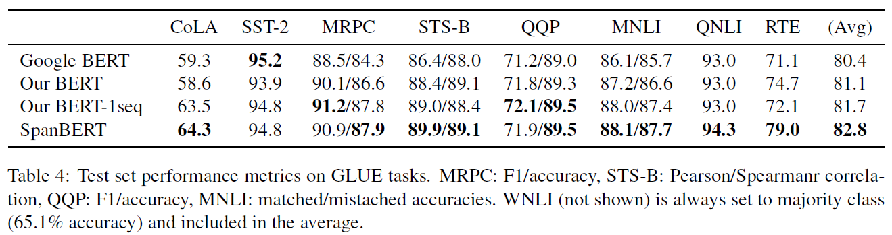
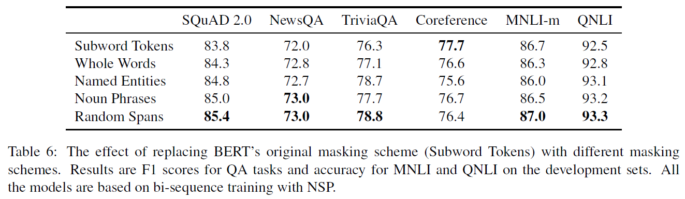

# SpanBERT: Improving Pre-training by Representing and Predicting Spans (SpanBERT)
## Information
- 2019 arXiv
- Joshi, Mandar, et al.

## Keywords
- NLU
- Pre-train
- BERT

## Contribution
- Present SpanBERT, a pre-training method that is designed to better represent and predict spans of text.
- Find that pre-training on single segments, instead of two half-length segments with the next sentence prediction(NSP) objective, significantl improves performance on most downstream tasks.

## Summary
- Present SpanBERT, a self-supervised pre-training method designed to better represent and predict spans of text.

- Different between SpanBERT and BERT:
	1. Mask random contiguous spans, rather than random individual tokens.
		- Span-based masking forces the model to predict entire spans solely using the context in which they appear.
	2. Introduce a novel span-boundary objective (SBO) to train the model to predict the entire masked span from the observed tokens at its boundary, without relying on the individual token representations within it.
		- The SBO encourages the model to store this span-level information at the boundary tokens, which can be easily accessed during fine tuning.
	3. Add the modifications on top of the tuned single-sequence BERT baseline, instead of two half-length segments with the next sentence prediction(NSP) objective.
		- Find that pre-training on single segments significantl improves performance on most downstream tasks.

- Model Architecture:
	- Illustration of SpanBERT training
		- 
	1. Span Masking
		1. Select a subset of tokens by iteratively sampling spans of text until the masking budget (e.g. 15% of X) has been spent.
		2. At each iteration, we first sample the span's length from a geometric distribution which is skewed towards shorter spans.
			- 
		3. Randomly (uniformly) select the starting point for the span.
		- As in BERT, we also mask 15% of the tokens in total: replacing 80% of the masked tokens with [MASK], 10% with random tokens and 10% with the original tokens. However, we perform this replacement at the span level and not for each token individually.
	2. Span Boundary Objective (SBO)
		- Introducing a span boundary objective that involves predicting each token of a masked span using only the representations of the observed tokens at the boundaries, like in Figure 1.
		- Formally, given a masked span (xs, ..., xe) ∈ Y, where (s,e) indicates its start and end positions, we represent each token xi in the span using the encodings of the external boundary tokens Xs-1 and Xe-1 as well as the positional embedding of the target token pi:
			- 
		- Implement the representation function f(.) as a 2-layer feed-forward network with GeLU activations and layer normalization:
			- 
		- Use the vector representation yi to predict xi and compute the cross-entropy loss exactly like the Masked Language Modeling(MLM) objective.
		- SpanBERT sums the loss from both the span boundary and the regular masked language modeling objectives for each token in the masked span.
			- L = LMLM + LSBO
	3. Single-Sequence Training
		- Find that using NSP objective is almost always worse than simply using a single sequence.
		- Single-sequence training is superior to bi-sequence training with NSP because:
			1. The model benefits from longer full-length contexts.
			2. Conditioning on context from another document adds noise to the masked language model.
		- Therefore, in SpanBERT, we remove both the NSP objective and the two-segment sampling procedure, and simply sample a single contiguous segment.

- Experiments:
	- Results on Extractive Question Answering:
		1. SQuAD 1.1 and 2.0 datasets
			- 
		2. MRQA dataset
			- 
	- Results on Coreference Resolution(OntoNotes):
		- 
	- Results on Relation Extraction(TACRED):
		- 
	- Results on GLUE:
		- 
	- Ablation Studies:
		1. Masking Schemes:
			- Schemes:
				1. Subword Tokens:
					- Sample random wordpiece tokens, as in the original BERT.
				2. Whole Words:
					- Sample random words, and then mask all of the subword tokens in those words.(The total number of masked subtokens is around 15%)
				3. Named Entities:
					- At 50% of the time, we sample from named entities(with spaCy's named entity recognizer) in the text, and sample random whole words for the other 50%.(The total number of masked subtokens is 15%)
				4. Noun Phrases:
					- Similar as Named Entities, we sample from noun phrases(with spaCy's constituency parser) at 50% of the time.
				5. Random Spans:
					- Sample random spans from a geometric distribution, as in the SpanBERT.
			- Results:
				- 
		2. Auxiliary Objectives:
			- 

## Source Code
- Fine-tuning is implemented based on HuggingFace's [codebase](https://github.com/huggingface/pytorch-transformers)
