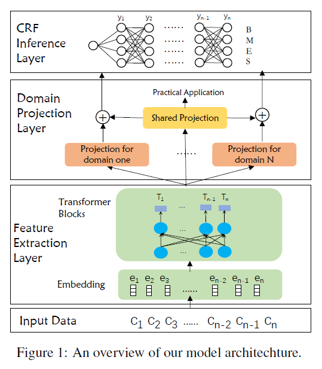
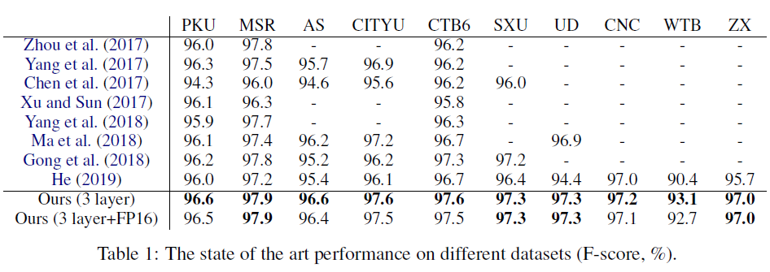
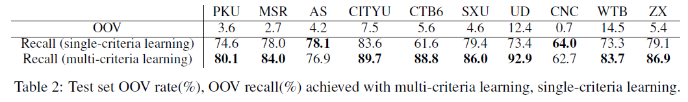
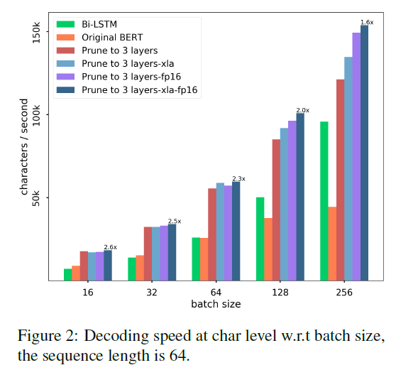
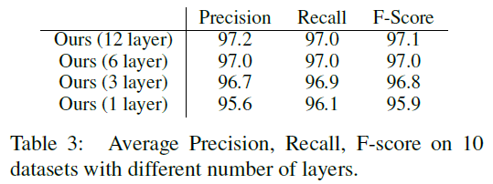
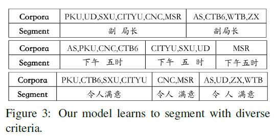

# Toward Fast and Accurate Neural Chinese Word Segmentation with Multi-Criteria Learning
## Information
- 2019 arXiv
- Huang, Weipeng, et al.

## Keywords
- Chinese
- Word Segmentation
- Chinese Word Segmentation(CWS)

## Contribution
- Proposed a domain adaptive segmenter to capture diverse criteria of datasets on Chinese Word Segmentation(CWS) task.
- Optimize model's computational efficiency via model pruning, quantization, and compiler optimization.

## Summary
- Propose a multi-criteria method of CWS which uses a domain projection layer to adopt multiple datasets with various granularities and optimize model's computational efficiency with several techniques.

- Model Description
	- 
	1. BERT for **Feature Extraction**:
		- Characters are first mapped into embedding vectors and then go through several transformer blocks.
	2. **Domain Projection** for Multi-Criteria Learning:
		- Propose a domain projection layer to enable our model to adapt datasets with diverse criteria.
		- The domain projection layer helps to capture heterogeneous segmentation criteria of each dataset.
		- Use linear transformation which is simple but effective for this task.
	3. **Tag Inference** by CRF:
		- The output of domain-specific projection and shared projection are concatenated, then feed into the conditional random fields (CRF) layer.
	4. **Speed Optimization**:
		1. Pruning:
			- Perform layer level pruning on the transformer blocks in BERT.
		2. Quantization:
			- Conduct fixed-point quantization:
				- Kernels of multi-head attention layers and feedforward layers use half precision(FP16).
				- Rest parameters like embedding and normalization parameters use full precision(FP32).
		3. Compiler Optimization:
			- XLA is a domain specific compiler for linear algebra that optimizes TensorFlow computations.
			- Introducing XLA into our model, graphs are compiled into machine instructions, low-level ops are fused to improve the execution speed.

- Experiments:
	- Main Results on different datasets:
		- 
	- OOV Rate:
		- 
	- Decoding speed:
		- 
	- Ablation Study:
		- 
	- Case Study:
		- 

## Source Code
- not found
