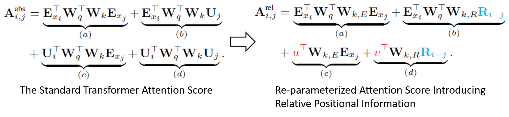

# Transformer-XL: Attentive Language Models Beyond a Fixed-Length Context(Transformer-XL)
## Information
- 2019 ACL
- Zihang Dai, Zhilin Yang, et al.

## Keywords
- Pre-train
- LM
- Language Representation

## Contribution
- Introducing the notion of recurrence in a purely self-attentive model.
- Introduce a simple but more effective relative positional encoding formulation that generalizes to attention lengths longer than the one observed during training.

## Summary
- Propose a novel neural architecture **Transformer-XL** that enables learning dependency beyond a fixed length without disrupting temporal coherence.

- The Drawbacks of Fixed Length Model:
	- 
	- The fixed context length
		- The model cannot capture any longer-term dependency beyond the predefined context length.
	- Context Fragmentation
		- The model lacks necessary contextual information needed to well predict the first few symbols, leading to inefficient optimization and inferior performance.

- Model Architecture:
	- Introduce the notion of recurrence into the deep self-attention network.
		- Instead of computing the hidden states from scratch for each new segment, we reuse the hidden states obtained in previous segments.
		- The reused hidden states serve as memory for the current segment, which builds up a recurrent connection between the segments.
		- Modeling very long term dependency becomes possible because information can be propagated through the recurrent connections.
		- Passing information from the previous segment can also resolve the problem of context fragmentation.
		- Introduce a simple but more effective relative positional encoding formulation that generalizes to attention lengths longer than the one observed during training.
	- Model:
		1. Segment-Level Recurrence with State Reuse
			- 
			- 
			- The critical difference lies in that the key **k** and the value **v** are conditioned on the extended context cached from the previous segment.
			- With this recurrence mechanism applied to every two consecutive segments of a corpus, it essentially creates a segment-level recurrence in the hidden states.
			- The effective context being utilized can go way beyond just two segments.
		2. Relative Positional Encodings
			- Problem to Solve:
				- How can we keep the positional information coherent when we reuse the states?
					- In the standard Transformer, the information of sequence order is provided by a set of positional encodings indicated the absolute position within a segment.
					- The positional encoding of both segments are the same.
					- As a result, the model has no information to distinguish the positional difference between segments.
			- Idea:
				- It is sufficient to know the relative distance between each key vector kτ,j and itself qτ,i , i.e. i-j.
				- Create a set of relative position encodings **R** where the i-th row **R**i indicates a relative distance of i between two positions.
				- By injecting the relative distance dynamically into the attention score, the query vector can easily distinguish the representations of xτ,j and xτ+1,j from their different distances, making the state reuse mechanism feasible.
			- Solution:
				- The attention score between query qi and key vector kj within the same segment can be decomposed as following:
					- 
				1. Replace all appearances of the absolute positional embedding Uj with its relative counterpart Ri-j in term (b) and (d), where R is a sinusoid encoding matrix without learnable parameters. This essentially reflects the prior that only the relative distance matters for where to attend.
				2. Introduce a trainable parameter u to replace the query UiTWqT in term (c). Since the query vector is the same for all query positions, it suggests that the attentive bias towards different words should remain the same regardless of the query position.
				3. A trainable parameter v is added to substitute UiTWqT in term (d) with a similar reasoning.
				4. Deliberately separate the two weight matrices Wk,E and Wk,R for producing the content-based key vectors and location-based key vectors respectively.
				- Under the new parameterization, each term has an intuitive meaning:
					1. Term (a) represents content-based addressing
					2. Term (b) captures a content-dependent positional bias
					3. Term (c) governs a global content bias
					4. Term (d) encodes a global positional bias
		- The computational procedure for a N-layer Transformer-XL with a single attention head here. For n = 1, ..., N:
			- 

- Results:
	- Results on WikiText-103 datasets:
		- 
	- Results on enwik8 datasets:
		- 
	- Results on text8 datasets:
		- 
	- Results on One Billion Word datasets:
		- 
	- Results on Penn Treebank datasets:
		- 
	- Ablation study on WikiText-103:
		- 

## Source Code
- [Transformer-XL](https://github.com/kimiyoung/transformer-xl)
