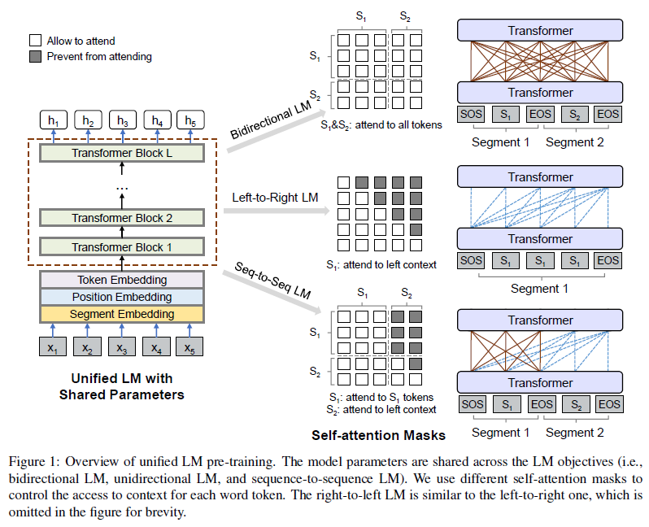
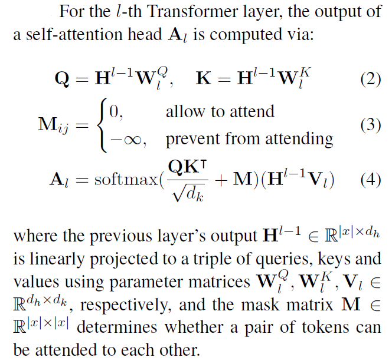
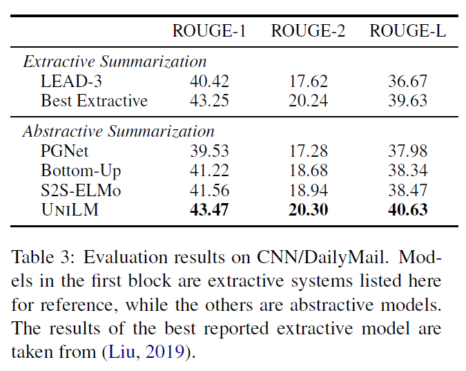
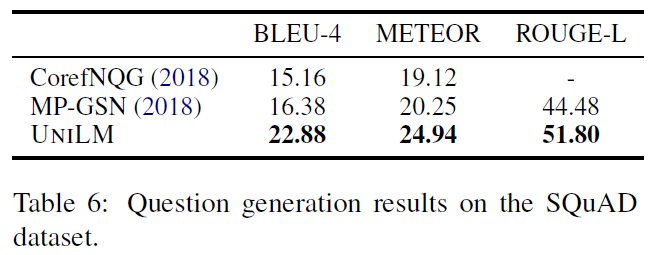
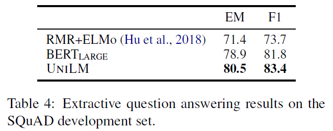
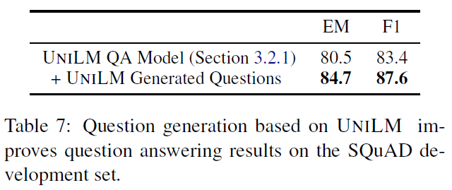
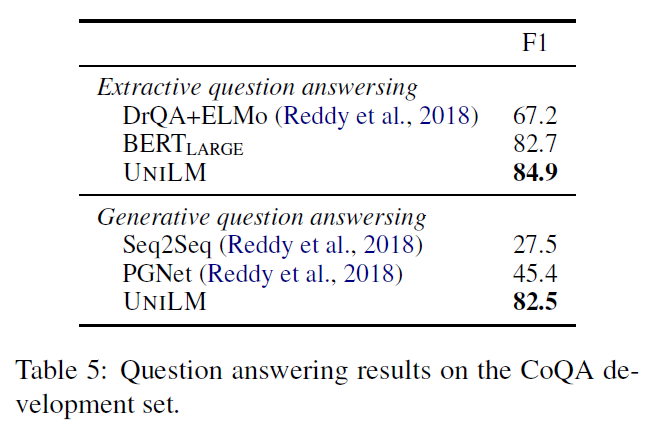
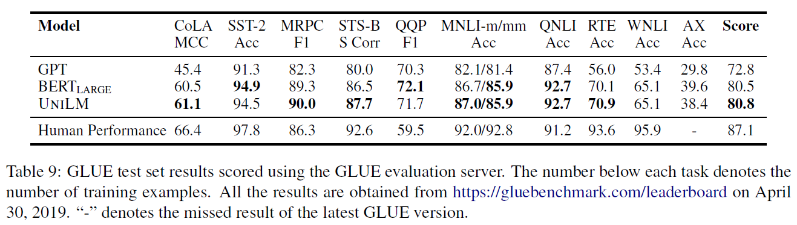

# Unified Language Model Pre-training for Natural Language Understanding and Generation (UNILM)
## Information
- 2019 arXiv
- Dong, Li, et al.

## Keywords
- NLU
- NLG
- LM
- Pre-train
- Fine-tunning

## Contribution
- Propose a new **UNI**fie pre-trained **L**anguage **M**odel (**UNILM**) that can be applied to both natural language understanding and generation tasks.

## Summary
- UNILM can be fine-tuned for both natural language understanding and generation tasks with three types of language modeling objectives.
- Employing a shared Transformer network and utilizing specific self-attention masks to control what context the prediction conditions on.

- Model Pre-training:
	- 
	- Based Model:
		- A multi-layer Transformer network
		- Self-attention Masks:
			- 
		- Multiple LM Objective:
			- The main difference among these LMs is what context they encode for each word token.
			- This is implemented using different self-attention masks as described in Equation (3).
			- Pretrain UNILM using four cloze tasks for the different language modeling objectives.
				- The training objective function is the sum of the mean likelihood of different types of LMs.
				1. Unidirectional LM(left-to-right) [1/6]
					- The representation of each token encodes only the left-ward context tokens and itself.
				2. Unidirectional LM(right-to-left) [1/6]
					- The representation of each token encodes only the right-ward context tokens and itself.
				3. Bidirectional LM [1/3]
					- Allows all tokens to attend to each other in prediction.
					- Include the next sentence prediction task for pre-training.
				4. Sequence-to-Sequence LM [1/3]
					- Takes two text segments as input
						1. The tokens in the first (source) segment can attend to each other from both directions within the segment.
						2. The tokens of the second (target) segment can only attend to the leftward context in the target segment and itself, as well as all the tokens in the source segment.
	- Input Representation:
		- Word Embedding
		- Position Embedding
			- Absolute position embedding, which assigns different vectors for positions.
		- Text segment Embedding
			- Texts are tokenized to subword units by WordPiece ([Wu et al., 2016](https://arxiv.org/abs/1609.08144)).

- Fine-tuning on Downstream Tasks:
	- Fine-tune the pre-trained UNILM (with additional task-specific layers if necessary) for various downstream tasks.
	1. UNILM for NLU:
		- Maximize the likelihood of the labeled training examples by updating the parameters of the pre-trained LM and the added softmax classifier.
	2. UNILM for NLG:
		- The model is fine-tuned by masking some percentage of tokens in the target sequence at random, and learning to recover the masked words.

- Results:
	- Results of Abstractive Summarization:
		- Fine-tune UNILM as a sequence-tosequence model.
		- 
	- Results of Question Generation:
		- 
	- Results of Question Answering:
		- SQuAD:
			- 
			- Results of Question Answering on SQuAD Improve by question answering results on the SQuAD:
				- 
		- CoQA:
			- 
	- Results on GLUE Benchmark:
		- 

## Source Code
not found