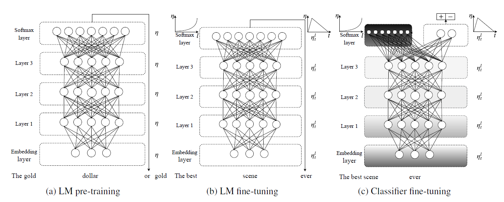
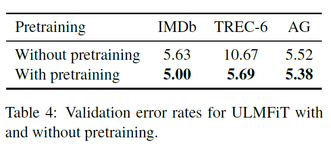
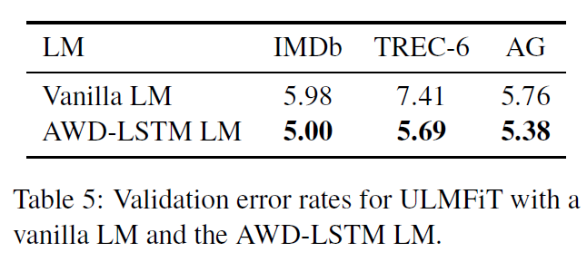
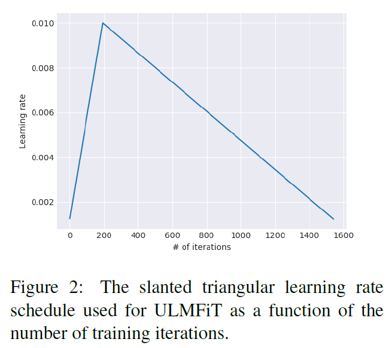
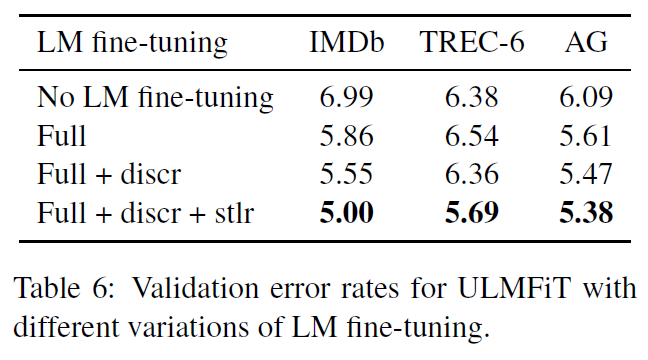
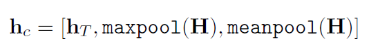
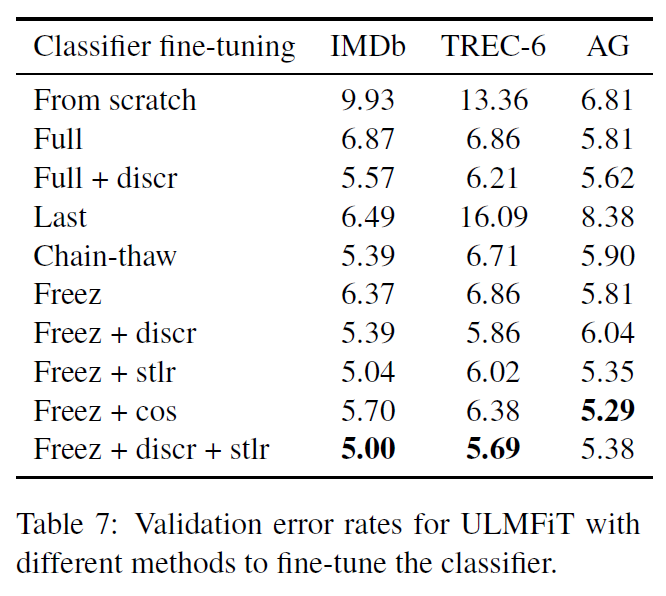
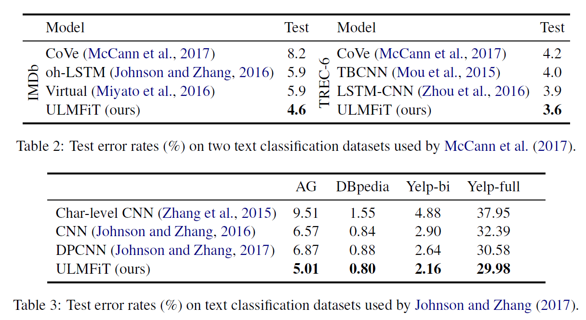

# Universal Language Model Fine-tuning for Text Classification
## Information
- 2018 ACL
- Howard, Jeremy, and Sebastian Ruder.

## Keywords
- Fine-tuning
- LM
- Text Classificationn
- Transfer Learning

## Contribution
- Propose ULMFiT to achieve computer vision like transfer learning for any task for NLP
- Propose novel techniques to retain previous knowledge and avoid catastrophic forgetting during fine-tuning
- Perform an extensive ablation analysis for the proposed tricks

## Summary
Propose an effective transfer learning method that can be applied to any task in NLP, Universal Language Model Fine-tuning (ULMFiT), including following Steps:

1. General-domain LM pre-training: 
	Learn a LM with Wikipedia articles.
	
	
2. Target task LM fine-tuning: 
	Fine-tune the LM on data of the target task with following tricks
 - Discriminative fine-tuning: 
 Instead of using the same learning rate for all layers of the model, tune each layer with different learning rates
 - Slanted triangular learning rates(STLR):
 First linearly increases the learning rate and then linearly decays it according to the following update schedule
 
 
3. Target task classifier fine-tuning: 
	Add two linear blocks and fine-tuneing with the Classificationn data
 - Concat pooling:
 Concatenate the hidden state at the last time step hT of the document with both the max-pooled and the mean-pooled representation of the hidden states over as many time steps as fit in GPU memory H = [h1, ..., hT]
 
 - Gradual unfreezing:
 First unfreeze the last layer and fine-tune all unfrozen layers for one epoch. Then unfreeze the next lower frozen layer and repeat, until we fine-tune all layers until convergence at the last iteration.
 - Backpropagation through time(BPTT) for Text Classification (BPT3C)
 - Bidirectional language model
 
 

## Source Code
- [ULMFiT for classification](http://nlp.fast.ai/category/classification.html)