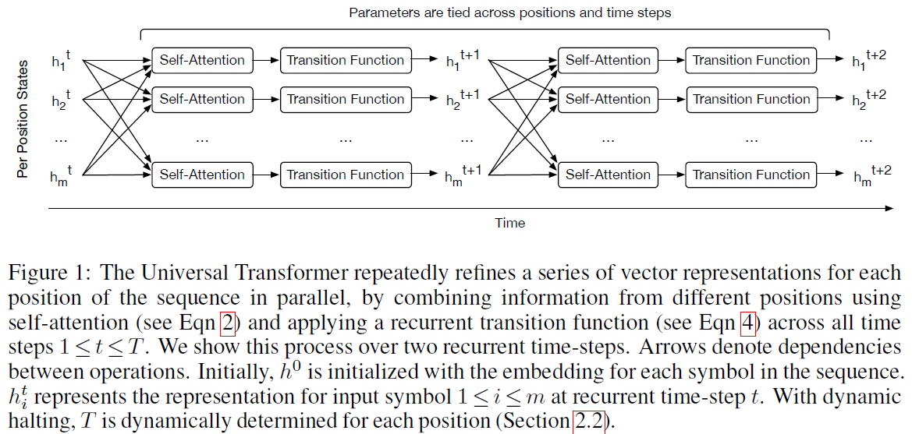
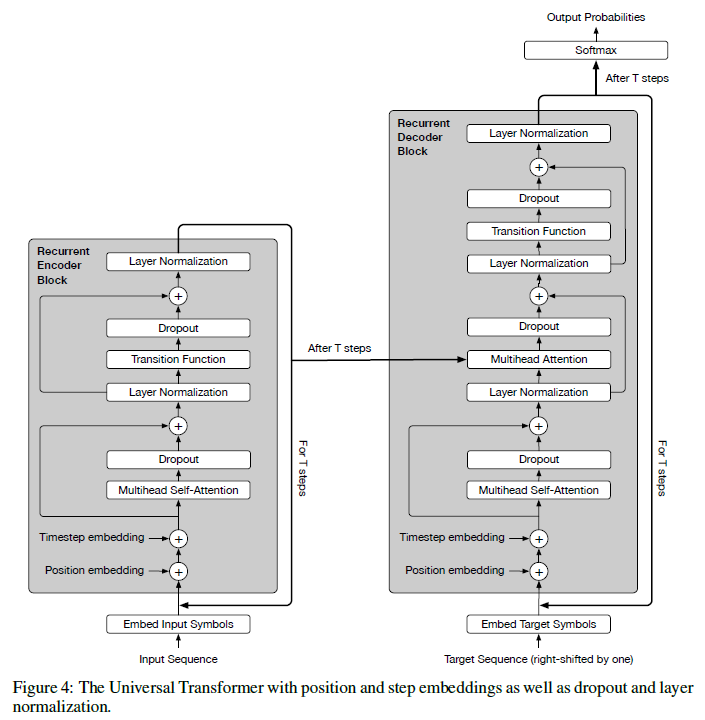
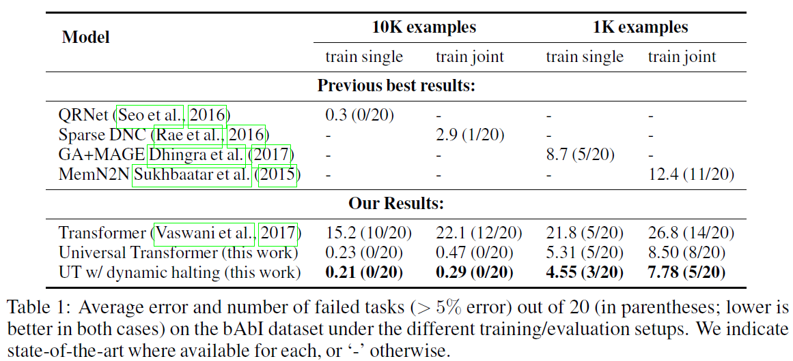
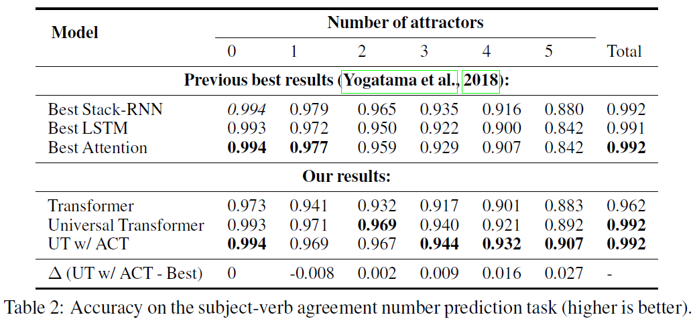
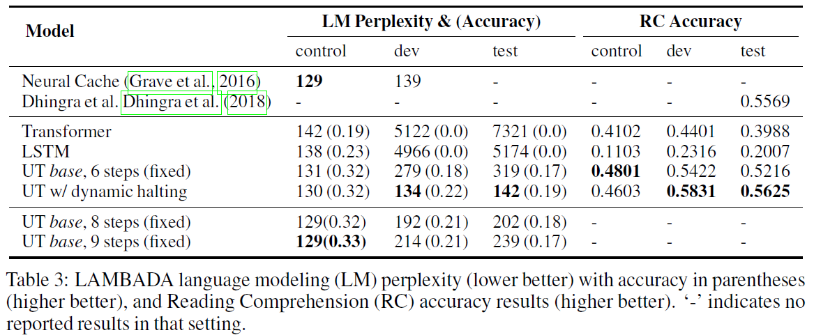
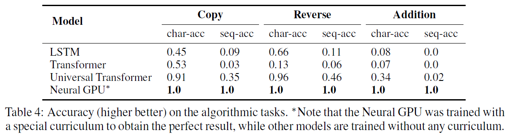
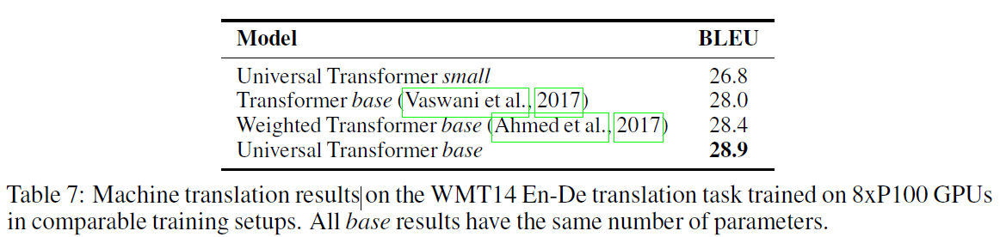

# Universal Transformers(UT)
## Information
- 2019 ICLR
- Dehghani, Mostafa, et al.

## Keywords
- NLU

## Contribution
- Propose the Universal Transformer(UT), a parallel-in-time self-attentive recurrent sequence model which can be cast as a generalization of the Transformer model and which addresses the issues of the standard Transformer.

## Summary
- UTs combine the parallelizability and global receptive field of feed-forward sequence models like the Transformer with the recurrent inductive bias of RNNs, which seems to be better suited to a range of algorithmic and natural language understanding sequence-to-sequence problems.
	- In each recurrent step, the Universal Transformer iteratively refines its representations for all symbols in the sequence in parallel using a self-attention mechanism followed by a transformation (shared across all positions and time-steps) consisting of a depth-wise separable convolution or a position-wise fully-connected layer.
		
		- A **self-attention mechanism** is to exchange information across all positions in the sequence, thereby generating a vector representation for each position that is informed by the representations of all other positions at the previous time-step.
		- Apply **transition function** (shared across position and time) to the outputs of the self-attention mechanism, independently at each position. As the recurrent transition function can be applied any number of times, this implies that UTs can have variable depth.
	- Also add a dynamic per-position halting mechanism allowing the model to choose the required number of refinement steps for each symbol dynamically.

- Model Description:
	
	- The UT is based on the popular encoder-decoder architecture commonly used in most neural sequence-to-sequence models.
	- The UT is not computationally bound by the number of symbols in the sequence, but only by the number of revisions made to each symbol's representation.
	- Encoder:
		- Apply the multi-headed dot-product self-attention mechanism from [Vaswani et al. (2017)](https://arxiv.org/abs/1706.03762), followed by a recurrent transition function.
		- Depending on the task, use one of two different transition functions: 
			- A separable convolution
			- A fully-connected neural network that consists of a single rectified-linear activation function between two affine transformations, applied position-wise.
		- Add residual connections around each of these function blocks and apply dropout and layer normalization.
	- Decoder:
		- Shares the same basic recurrent structure of the encoder.
		- Decoder additionally also attends to the final encoder representation HT of each position in the input sequence using the same multihead dot-product attention function.
		- Trained using teacher-forcing, at generation time it produces its output one symbol at a time, with the decoder consuming the previously produced output positions. During training, the decoder input is the target output, shifted to the right by one position.
		- The decoder self-attention distributions are further masked so that the model can only attend to positions to the left of any predicted symbol.
	- Dynamic Halting:
		- Adaptive Computation Time (ACT) is a mechanism for dynamically modulating the number of computational steps needed to process each input symbol (called the "ponder time") in standard recurrent neural networks based on a scalar halting probability predicted by the model at each step.
		- Once the per-symbol recurrent block halts, its state is simply copied to the next step until all blocks halt, or we reach a maximum number of steps.

- Differences form Standard Transformer:
	1. Recurrent transition function
	2. Dynamic Halting

- Results:
	- bAbi Question Answering Result:
		- The bAbi question answering dataset consists of 20 different tasks, where the goal is to answer a question given a number of English sentences that encode potentially multiple supporting facts.
		- The goal is to measure various forms of language understanding by requiring a certain type of reasoning over the linguistic facts presented in each story.
		- A standard Transformer does not achieve good results on this task.
		
	- Subject-verb Agreement Result:
		- Consider the task of predicting number-agreement between subjects and verbs in English sentences.
		- This task acts as a proxy for measuring the ability of a model to capture hierarchical (dependency) structure in natural language sentences.
		
	- LAMBADA Task Result:
		- It is a language modeling task consisting of predicting a missing target word given a broader context of 4-5 preceding sentences.
		
	- Algorithmic Tasks Result:
		- Three algorithmic tasks, namely Copy, Reverse, and (integer) Addition, all on strings composed of decimal symbols ('0'-'9').
		
	- Machine Translation Result:
		

## Source Code
- [tensor2tensor](https://github.com/tensorflow/tensor2tensor)