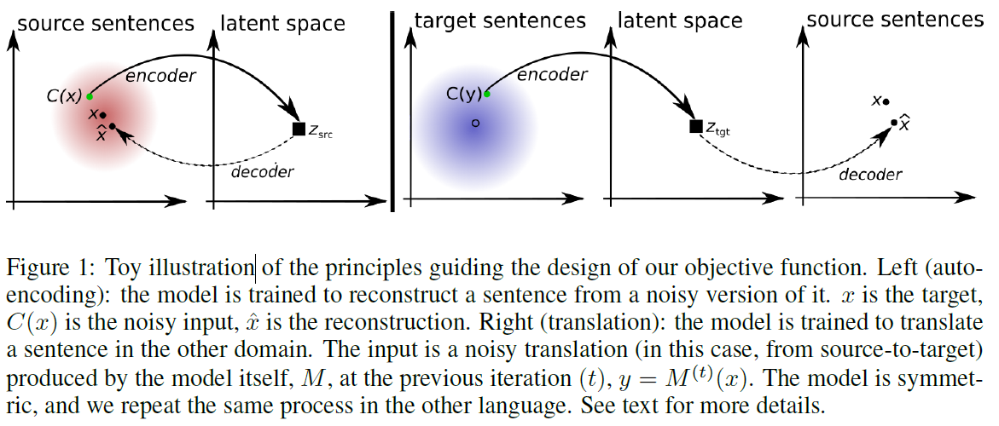
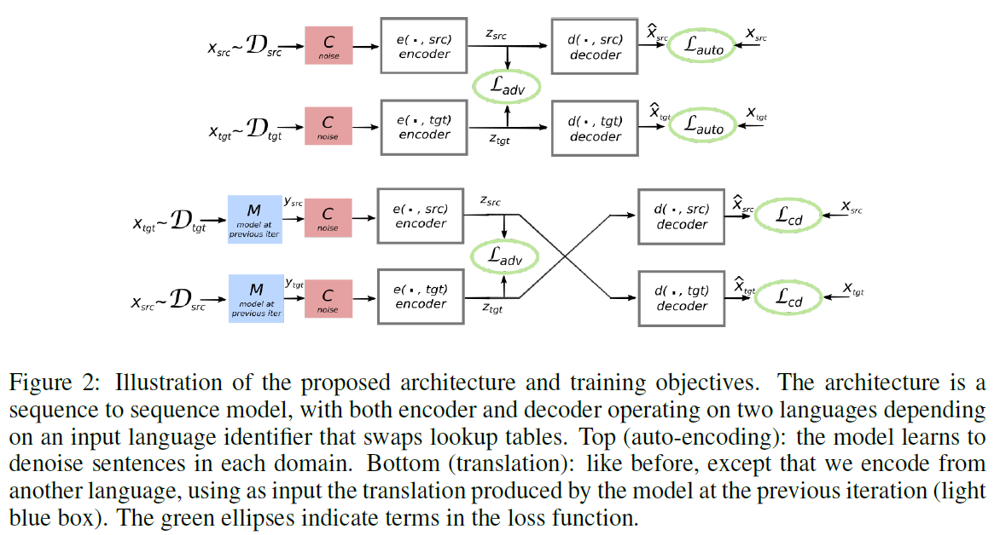
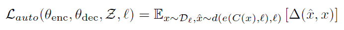
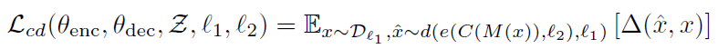
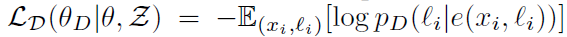
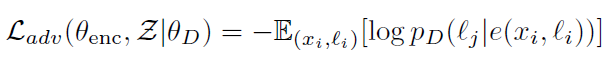
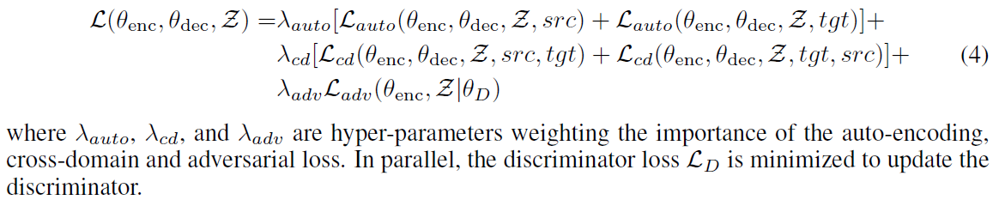
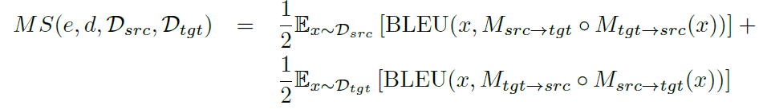
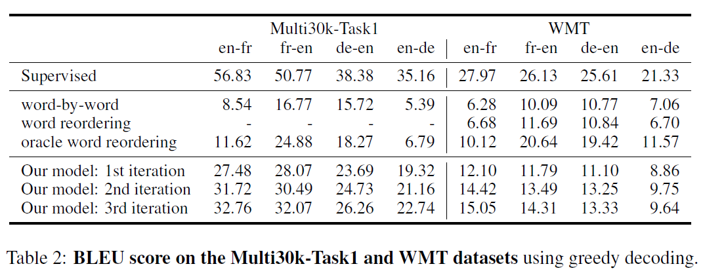

# Unsupervised Machine Translation Using Monolingual Corpora Only
## Information
- 2018 ICLR
- Lample, Guillaume, et al.

## Keywords
- Unsupervised Learning
- Machine Translation

## Contribution
- This paper propose a machine translation encoder-decoder structure trained without any parallel data, i.e. an unsupervised method.

## Summary
- Concepts:
	
	- Propose a model that takes sentences from monolingual corpora in two different languages and maps them into the same latent space.
	- By learning to reconstruct in both languages from this shared feature space, the model effectively learns to translate without using any labeled data.

- Model Structure:
	
	1. Denoising Auto-encoding:
		
		- To prevent simple copy from input sequence with attentioned Seq2Seq model, adopt the same strategy of Denoising Auto-encoders.
		- The reconstruction of the corrupted version of x (x_hat) should be close to the origin x.
		- Noise model C(x):
			1. Drop every word in the input sentence with a probability pwd.
			2. Slightly shuffle the input sentence.
	2. Cross Domain Training:
		- This objective is to constrain the model to be able to map an input sentence from a the source/target domain to the target/source domain.
		
		1. Apply the current translation model denoted M to x, y=M(x)
		2. Obtain the corrupted version C(y)
		3. Objective is thus to learn the encoder and the decoder such that they can reconstruct x from C(y)
	3. Adversarial Training:
		- Let the encoder to output features in the same space regardless of the actual language of the input sentence.
		1. Train a neural network as the discriminator to classify between the encoding of source sentences and that of target sentences.
			
		2. The encoder is trained instead to fool the discriminator.
			
	- Final Objective function:
		 

- Unsupervised Model Selection Criterion
	- In order to select hyper-parameters, need a criterion correlated with the translation quality.
	
	- The quality of the model is evaluated by computing the BLEU score over the original inputs and their reconstructions via this two-step translation process
	- M is the translation model.

- Results:
	

## Source Code
not found