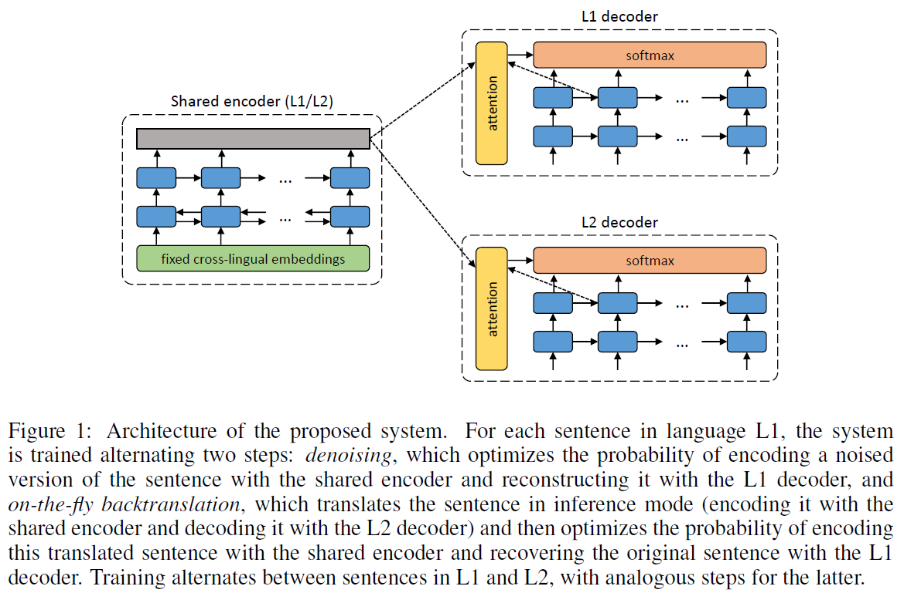
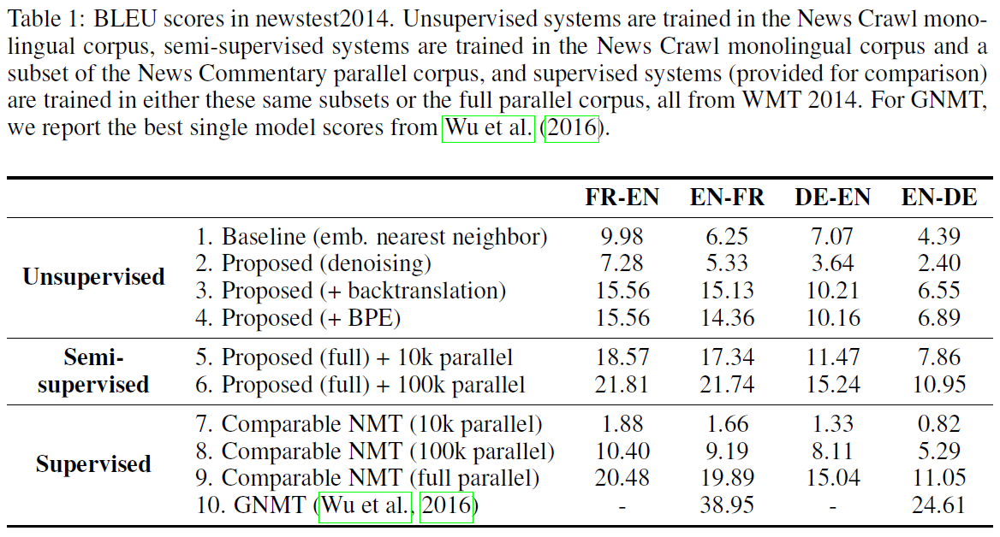

# Unsupervised Neural Machine Translation
## Information
- 2018 ICLR
- Artetxe, Mikel, et al.

## Keywords
- Unsupervised Learning
- Machine Translation

## Contribution
- Completely remove the need of parallel data and propose a novel method to train an NMT system in a completely unsupervised manner, relying on nothing but monolingual corpora.

## Summary
- Builds upon the recent work on unsupervised embedding mappings, and consists of a slightly modified attentional encoder-decoder model that can be trained on monolingual corpora alone using a combination of denoising and backtranslation.
- Thanks to a shared encoder for both translation directions that uses these fixed cross-lingual embeddings, the entire system can be trained, with monolingual data, to reconstruct its input.

- Model Architecture:
	- proposed system follows a fairly standard encoder-decoder architecture with an attention mechanism.
	
	- Important aspects that differs from the standard NMT:
		1. Dual structure:
			- Exploit the dual nature of machine translation and handle both directions together(e.g. French <=> English).
		2. Shared encoder:
			- Makes use of one and only one encoder that is shared by both languages involved.
			- This universal encoder is aimed to produce a language independent representation of the input text, which each decoder should then transform into its corresponding language.
		3. Fixed embeddings in the encoder:
			- Use pre-trained cross-lingual embeddings in the encoder that are kept fixed during training.
			- This way, the encoder is given language independent word-level representations, and it only needs to learn how to compose them to build representations of larger phrases.
			- Even if the embeddings are crosslingual, we use separate vocabularies for each language.
			- Pre-trained cross-lingual embedding:
				- Apply byte pair encoding (BPE).
				- Train embedding with the skip-gram model.
				- Use the public [implementation](https://github.com/artetxem/vecmap) of the method proposed by [Artetxe et al. (2017)](https://aclweb.org/anthology/P17-1042) to map these embeddings to a shared space, using the recommended configuration with numeral-based initialization.

- Unsupervised Training:
	- Denoising:
		- In order to avoid trivial copying solutions and make the encoder truly learn the compositionality of its input words in a language independent manner, propose to introduce random noise in the input sentences.
		- Alter the word order of the input sentence by making random swaps between contiguous words.
	- On-the-fly backtranslation:
		- Use the system in inference mode with greedy decoding to translate it to the other language (i.e. apply the shared encoder and the decoder of the other language). This way, obtain a pseudo-parallel sentence pair, and train the system to predict the original sentence from this synthetic translation.
		- Take advantage of the dual structure of the proposed architecture to backtranslate each mini-batch on-the-fly using the model that is being trained itself.
			- Contrary to standard backtranslation, which uses an independent model to backtranslate the entire corpus at one time.

- Training Steps:
	- we alternate these different training objectives from mini-batch to mini-batch. This way, given two languages L1 and L2, each iteration would:
		1. Perform one mini-batch of denoising for L1.
		2. Perform one mini-batch of denoising for L2.
		3. Perform one mini-batch of on-the-fly backtranslation from L1 to L2
		4. Perform one mini-batch of on-the-fly backtranslation from L2 to L1

- Results:
	

## Source Code
- [UNdreaMT](https://github.com/artetxem/undreamt)