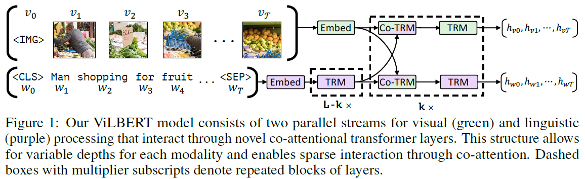
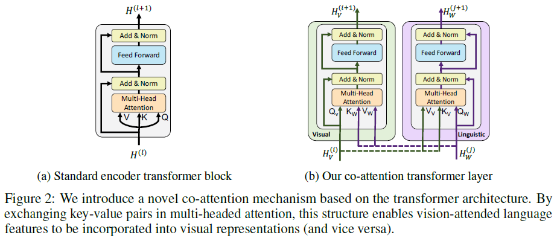
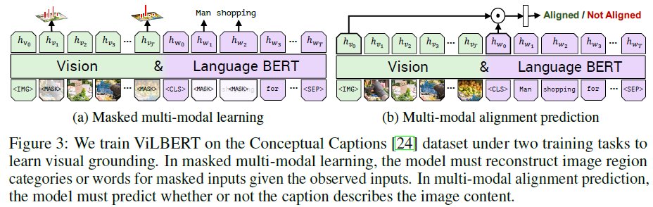
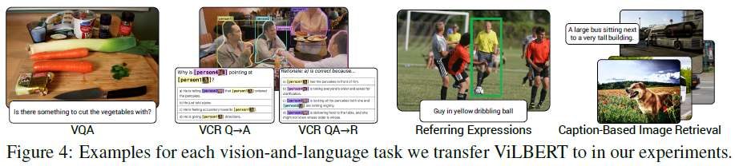
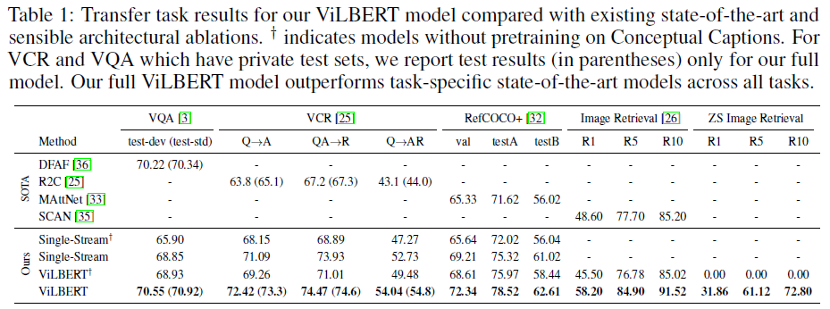
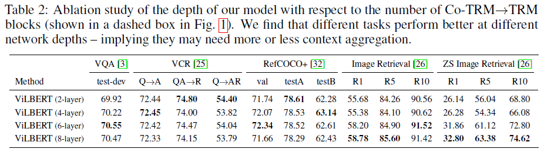
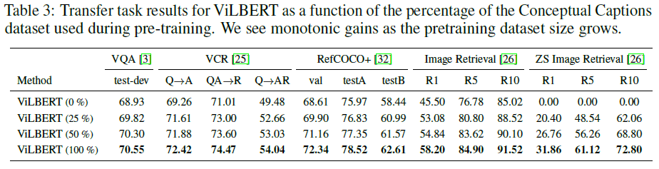

# ViLBERT: Pretraining Task-Agnostic Visiolinguistic Representations for Vision-and-Language Tasks (ViLBERT)
## Information
- 2019 arXiv
- Lu, Jiasen, et al.

## Keywords
- MultiModel
- BERT
- VQA(Visual Question Answering)

## Contribution
- Introduce separate streams for vision and language processing that communicate through co-attentional transformer layers.

## Summary
- ViLBERT (Vision-and-Language BERT), a model for learning task-agnostic joint representations of image content and natural language.
- Extend the popular BERT architecture to a multi-modal two-stream model, processing both visual and textual inputs in separate streams that interact through co-attentional transformer layers.
- Pretrain the model through two proxy tasks on the large, automatically collected Conceptual Captions dataset and then transfer it to multiple established vision-and-language tasks.

- ViLBERT: Extending BERT to Jointly Represent Images and Text
	- Training tasks to learn joint representations of language and visual content from paired data.
	- Develop a two-stream architecture modelling each modality separately and then fusing them through a small set of attention-based interactions.
	- This approach allows for variable network depth for each modality and enables cross-modal connections at different depths.
	- Elements in ViLBERT:
		- 
		1. Transformer blocks (TRM)
		2. Novel co-attentional transformer layers (Co-TRM)
			- 
			- Introduced to enable information exchange between modalities.
			- Given intermediate visual and linguistic representations, the module computes query, key, and value matrices as in a standard transformer block.
				- The keys and values from each modality are passed as input to the other modality's multi-headed attention block.
				- The attention block produces attention-pooled features for each modality conditioned on the other - in effect performing image-conditioned language attention in the visual stream and language-conditioned image attention in the linguistic stream.
	- Pretraining Tasks:
		- 
		1. Masked Multi-modal Modelling
			- Follows from the masked language modelling task in standard BERT - masking approximately 15% of both words and image region inputs and tasking the model with reconstructing them given the remaining inputs.
			1. Masked text inputs:
				- Handled as in BERT.
			2. Masked image inputs:
				- Rather than directly regressing the masked feature values, the model instead predicts a distribution over semantic classes for the corresponding image region.
				- To supervise this, take the output distribution for the region from the same pretrained detection model used in feature extraction(use Faster R-CNN pretrained on the Visual Genome dataset to extract region features).
		2. Multi-modal Alignment Prediction
			- Predict whether the image and text are aligned.

- Experiments:
	- The Vision-and-Language Transfer Tasks:
		- 
		1. Visual Question Answering (VQA)
			- The VQA task requires answering natural language questions about images.
		2. Visual Commonsense Reasoning (VCR)
			- Given an image, the VCR task presents two problems – visual question answering (Q->A) and answer justification (QA->R) – both being posed as multiplechoice problems.
		3. Grounding Referring Expressions
			- The referring expression task is to localize an image region given a natural language reference.
		4. Caption-Based Image Retrieval
			- Caption-based image retrieval is the task of identifying an image from a pool given a caption describing its content.
	- Results on the Vision-and-Language Transfer Tasks
		- 
	- Ablation studys:
		- Effect of Visual Stream Depth
			- 
		- Benefits of Large Training Sets:
			- 

## Source Code
- not found
