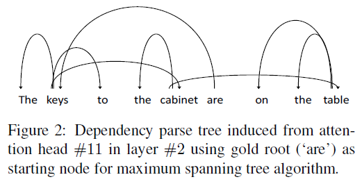

# What does BERT learn about the structure of language?
## Information
- 2019 ACL Short
- Jawahar, Ganesh, et al.

## Keywords
- NLU
- Pre-train
- BERT
- Explainable
- Probing

## Contribution
- Perform a series of experiments to probe the nature of the representations learned by different layers of BERT.
	- Show that the lower layers capture phrase-level information, which gets diluted in the upper layers.
	- Propose to use the probing tasks to show that BERT captures a rich hierarchy of linguistic information, with surface features in lower layers, syntactic features in middle layers and semantic features in higher layers.
	- Test the ability of BERT representations to track subject-verb agreement and find that BERT requires deeper layers for handling harder cases involving long-distance dependencies.
	- Propose to use the recently introduced Tensor Product Decomposition Network (TPDN)([McCoy et al., 2019](https://arxiv.org/abs/1812.08718)) to explore different hypotheses about the compositional nature of BERT representation and find that BERT implicitly captures classical, tree-like structures.

## Summary
- Provide novel support for the claim, that BERT networks capture structural information about language, by performing a series of experiments to unpack the elements of English language structure learned by BERT.

- Experiments:
	1. Phrasal Syntax:
		- 
			- Observe that BERT mostly captures phrase-level information in the lower layers and that this information gets gradually diluted in higher layers.
		- 
			- Perform a k-means clustering on span representations with k = 10, i.e. the number of distinct chunk types.
			- Evaluating the resulting clusters using the Normalized Mutual Information(NMI) metric shows again that the lower layers encode phrasal information better than higher layers.
	2. Probing Tasks:
		- Probing (or diagnostic) tasks help in unearthing the linguistic features possibly encoded in neural models.
		- Set up an auxiliary classification task where the final output of a model is used as features to predict a linguistic phenomenon of interest.
		- Probing tasks:
			1. Surface tasks
				- Sentence length (SentLen)
				- The presence of words in the sentence (WC)
			2. Syntactic tasks
				- Sensitivity to word order (BShift)
				- The depth of the syntactic tree (TreeDepth)
				- The sequence of top-level constituents in the syntax tree (TopConst)
			3. Semantic tasks
				- The tense (Tense)
				- The subject number in the main clause (SubjNum)
				- The direct object number in the main clause (ObjNum)
				- The sensitivity to random replacement of a noun/verb (SOMO)
				- The random swapping of coordinated clausal conjuncts (CoordInv)
		- 
			- Shows that BERT embeds a rich hierarchy of linguistic signals: surface information at the bottom, syntactic information in the middle, semantic information at the top.
	3. Subject-Verb Agreement:
		- Subject-verb agreement is a proxy task to probe whether a neural model encodes syntactic structure.
		- The task of predicting the verb number becomes harder when there are more nouns with opposite number (attractors) intervening between the subject and the verb.
		- Performing the test on each layer of BERT and controlling for the number of attractors.
			- 
			- Show that the middle layers perform well in most cases, which supports the results where the syntactic features were shown to be captured well in the middle layers.
			- Highlight the need for BERT to have deeper layers to perform competitively on NLP tasks.
	4. Compositional Structure:
		- Use Tensor Product Decomposition Networks (TPDN) ([McCoy et al., 2019](https://arxiv.org/abs/1812.08718)) which explicitly compose the input token("filler") representations based on the role scheme selected beforehand using tensor product sum.
		- Assume that, for a given role scheme, if a TPDN can be trained well to approximate the representation learned by a neural model, then that role scheme likely specifies the compositionality implicitly learned by the model.
		- Initialize the filler embeddings of the TPDN with the pre-trained word embeddings from BERT’s input layer, freeze it, learn a linear projection on top of it and use a Mean Squared Error (MSE) loss function.
			- 
			- Discover that BERT implicitly implements a tree-based scheme, as a TPDN model following that scheme best approximates BERT’s representation at most layers.
			- BERT encodes classical, tree-like structures despite relying purely on attention mechanisms.
		- Perform a case study on dependency trees induced from self attention weight following the work done by [Raganato and Tiedemann (2018)](https://aclweb.org/anthology/W18-5431).
			- Displays the dependencies inferred from an example sentence by obtaining self attention weights for every word pairs from attention head #11 in layer #2, fixing the gold root as the starting node and invoking the Chu-Liu-Edmonds algorithm ([Chu and Liu, 1967](https://www.semanticscholar.org/paper/On-the-shortest-arborescence-of-a-directed-graph-Chu-Liu/73d72f0641463cd269b5efc590fafb2798fe19bd#extracted)).
			- 

## Source Code
- [interpret_bert](https://github.com/ganeshjawahar/interpret_bert)
