# Word Translation Without Parallel Data
## Information
- 2018 ICLR
- Conneau, Alexis, et al.

## Keywords
- Unsupervised Learning
- Machine Translation

## Contribution
- Present an unsupervised approach that reaches or outperforms state-of-the-art supervised approaches on several language pairs and on three different evaluation tasks.
- Introduce a cross-domain similarity adaptation to mitigate the so-called hubness problem (points tending to be nearest neighbors of many points in high-dimensional spaces).
- Propose an unsupervised criterion that is highly correlated with the quality of the mapping, that can be used both as a stopping criterion and to select the best hyper-parameters.

## Summary
- This paper focuses on learning a mapping between the two sets of embeddings trained independently on monolingual data such that translations are close in the shared space.
- Model Illustration:
	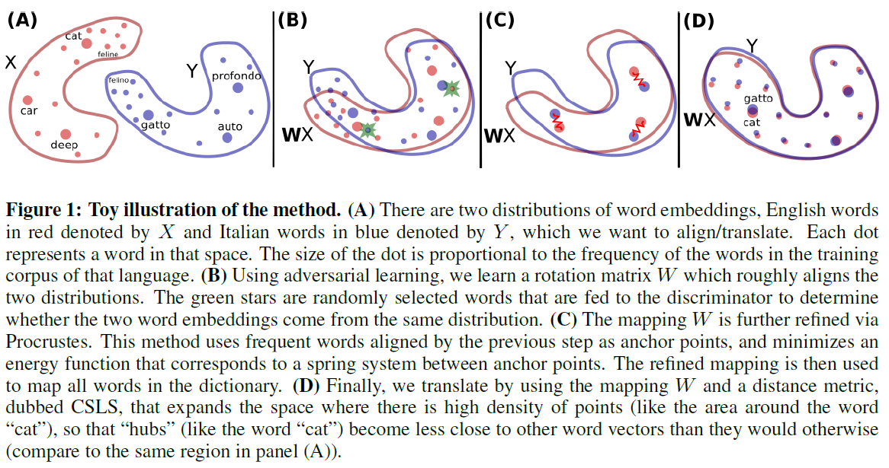
	1. Prepare two sets of embeddings trained independently on monolingual data.
	2. Adversarial Learning:
		1. Discriminator:
			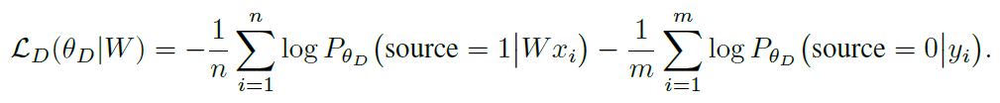
			- Trained to discriminate between elements randomly sampled from Wx and y
		2. Generator:
			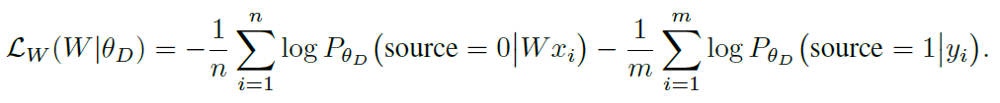
			- Trained to prevent the discriminator from making accurate predictions.
		- Update W:
			- Propose to use a simple update step to ensure that the matrix W stays close to an orthogonal matrix during training.
			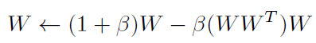
			where β = 0.01
	3. Refine Via Procrustes.:
		- Why apply Procrustes to refine the mapping matrix?
			- The adversarial approach tries to align all words irrespective of their frequencies. However, rare words have embeddings that are less updated and are more likely to appear in different contexts in each corpus, which makes them harder to align.
			- Under the assumption that the mapping is linear, it is then better to infer the global mapping using only the most frequent words as anchors.
		- Parallel Vocabulary:
			- Build a synthetic parallel vocabulary using the W just learned with adversarial training. Specifically, consider the most frequent words and retain only mutual nearest neighbors to ensure a high-quality dictionary according to CSLS.
		- Procrustes solution:
			- A closed form solution obtained from the singular value decomposition(SVD)
				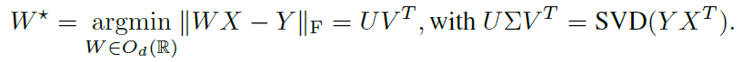
	4. Translate:
		- Mapping with matrix W refined via Procrustes.
		- Using the defined similarity measure CSLS to retain the matching pairs between two languages.
			- Reason to define a new similarity measure:
				- Some vectors, dubbed hubs, are with high probability nearest neighbors of many other points, while others (anti-hubs) are not nearest neighbors of any point.
			- Mean similarity of a source embedding xs to its target neighborhood as:
				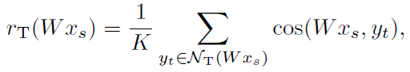 
				where NT is the neighborhoods.
			- Similarity measure CSLS:
				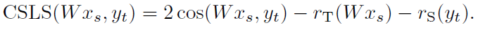 
				- Intuitively, this update increases the similarity associated with isolated word vectors. Conversely it decreases the ones of vectors lying in dense areas.

- Unsupervised Validation Criterion:
	- Consider the 10k most frequent source words, and use CSLS to generate a translation for each of them. We then compute the average cosine similarity between these deemed translations, and use this average as a validation metric.
	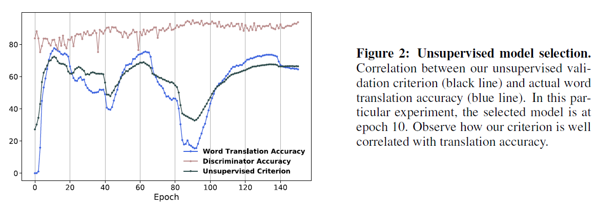

- Results:
	- Word translation:
		- 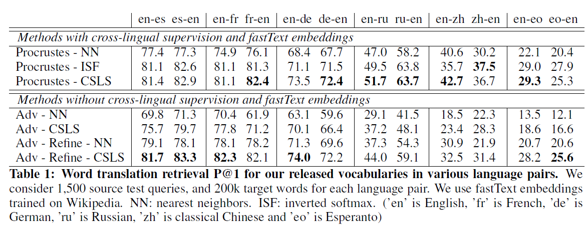
		- 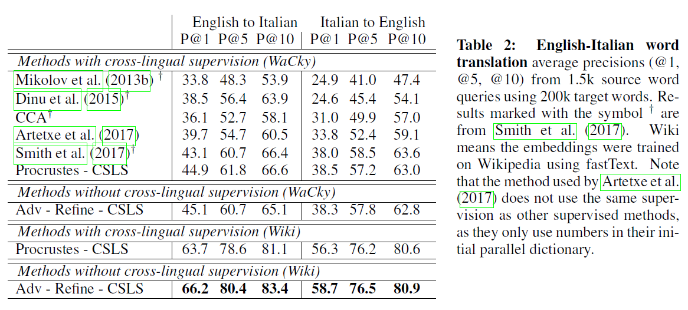
	- Sentence translation:
		- 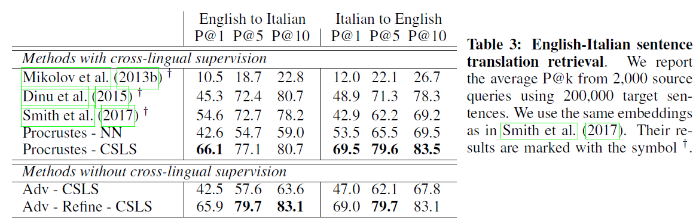

## Source Code
- [MUSE](https://github.com/facebookresearch/MUSE)