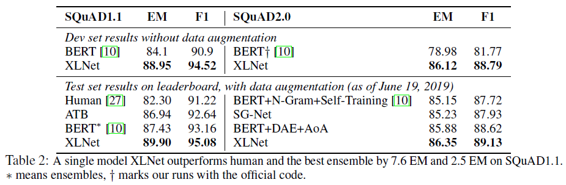

# XLNet: Generalized Autoregressive Pretraining for Language Understanding(XLNet)
## Information
- 2019 arXiv
- Zhilin Yang, Zihang Dai, et al.

## Keywords
- Pre-train
- LM
- Language Representation
- Transformer-XL
- BERT

## Contribution
- Propose a pretraining objective that brings the advantages of both Autoregressive(AR) language modeling and Autoencoding(AE) while avoiding their weaknesses.
- XLNet is motivated by enabling AR language models to learn bidirectional contexts.

## Summary
- XLNet, a generalized autoregressive pretraining method
	- Enables learning bidirectional contexts by maximizing the expected likelihood over all permutations of the factorization order.
	- Overcomes the limitations of BERT thanks to its autoregressive formulation.
	- Integrates ideas from Transformer-XL(the **segment recurrence mechanism** and **relative encoding scheme**), the state-of-the-art autoregressive model, into pretraining.
	- Propose to reparameterize the Transformer(-XL) network to remove the target ambiguous problem(because the factorization order is arbitrary).

- Drawbacks of AR language modeling and AE:
	1. Drawbacks of AR:
		- AR language model training objective
			- 
		1. Context dependency:
			- Not effective at modeling deep bidirectional contexts.
	2. Drawbacks of AE:
		- AE language model training objective
			- 
		1. Pretrain-finetune Discrepancy:
			- The artificial symbols like [MASK] used by BERT during pretraining are absent from real data at finetuning time, resulting in a **pretrain-finetune discrepancy**.
		2. Independence Assumption:
			- BERT assumes the predicted tokens are independent of each other given the unmasked tokens, which is oversimplified as high-order, long-range dependency is prevalent in natural language.

- How XLNet avoiding the drawbacks of AR and AE:
	1. [AR] XLNet maximizes the expected log likelihood of a sequence w.r.t. **all possible permutations of the factorization order**.
		- The context for each position can consist of tokens from both left and right, capturing bidirectional context.
	2. [AE] As a generalized AR language model, XLNet does not rely on data corruption.
		- XLNet does not suffer from the pretrain-finetune discrepancy that BERT is subject to.
	3. [AE] The autoregressive objective also provides a natural way to use the product rule for factorizing the joint probability of the predicted tokens.
		- Eliminate the independence assumption made in BERT.

- XLNet Model:
	- **Permutation Language Modeling Objective**
		- 
		- Not only retains the benefits of AR models but also allows models to capture bidirectional contexts.
			1. As this objective fits into the AR framework, it naturally avoids the independence assumption and the pretrain-finetune discrepancy.
			2. Intuitively, if model parameters are shared across all factorization orders, in expectation, the model will learn to gather information from all positions on both sides.
		- The proposed objective only permutes the factorization order, not the sequence order.
			- Keep the original sequence order, use the positional encodings corresponding to the original sequence, and rely on a proper attention mask in Transformers to achieve permutation of the factorization order.
	- **Two-Stream Self-Attention for Target-Aware Representations**
		- The problem of Transformer with permutation language modeling objective:
			- 
		- Target-Aware Representations:
			- Propose to re-parameterize the next-token distribution to be target position aware
			- 
		- Two-Stream Self-Attention:
			- The content representation and query representation:
				- 
			- Architecture of Two-Stream Self-Attention:
				- 
			- The update rule of Two-Stream Self-Attention:
				- 
	- Incorporating Ideas from Transformer-XL:
		- The Relative Positional Encoding Scheme
		- The Segment Recurrence Mechanism
			- 
	- Modeling Multiple Segments:
		- The input to the model is similar to BERT: [A, SEP, B, SEP, CLS], where "SEP" and "CLS" are two special symbols and "A" and "B" are the two segments.
		- Although we follow the two-segment data format, XLNet-Large does not use the objective of next sentence prediction as it does not show consistent improvement in the ablation study.
		- Relative Segment Encodings:
			- Different from BERT that adds an absolute segment embedding to the word embedding at each position, we extend the idea of relative encodings from Transformer-XL to also encode the segments.
			- Only consider whether the two positions are within the same segment, as opposed to considering which specific segments they are from.
			- Benefits:
				1. The inductive bias of relative encodings improves generalization.[[cite](https://arxiv.org/abs/1901.02860)]
				2. It opens the possibility of finetuning on tasks that have more than two input segments, which is not possible using absolute segment encodings.
- Compare with BERT:
	- To better understand the difference, let’s consider a concrete example [New, York, is, a, city]. Suppose both BERT and XLNet select the two tokens [New, York] as the prediction targets and maximize logp(New York | is a city). Also suppose that XLNet samples the factorization order [is, a, city, New, York]. In this case, BERT and XLNet respectively reduce to the following objectives:
		- 

- Results:
	- Results on RACE datasets:
		- 
		- The RACE dataset contains near 100K questions taken from the English exams for middle and high school Chinese students in the age range between 12 to 18, with the answers generated by human experts.
		- This is one of the most difficult reading comprehension datasets that involve challenging reasoning questions.
		- The average length of the passages in RACE are longer than 300, therefore, this dataset serves as a challenging benchmark for long text understanding.
	- Results on SQuAD datasets:
		- 
		- SQuAD is a large-scale reading comprehension dataset with two tasks:
			1. SQuAD1.1 contains questions that always have a corresponding answer in the given passages.
			2. SQuAD2.0 introduces unanswerable questions.
	- Results on text classification datasets:
		- 
	- Results on GLUE datasets:
		- 
		- The GLUE dataset is a collection of 9 natural language understanding tasks.
	- Results on ClueWeb09-B datasets:
		- 
		- The ClueWeb09-B dataset is for evaluating the performance on document ranking.
	- Ablation Study Results:
		- 
		1. The effectiveness of the permutation language modeling objective, especially compared to the denoising auto-encoding objective used by BERT.
		2. The importance of using Transformer-XL as the backbone neural architecture and employing segment-level recurrence (i.e. using memory).
		3. The necessity of some implementation details including span-based prediction, the bidirectional input pipeline, and next-sentence prediction.

## Source Code
- [XLNet](https://github.com/zihangdai/xlnet)