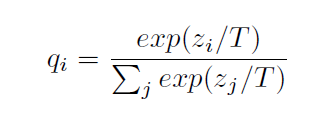
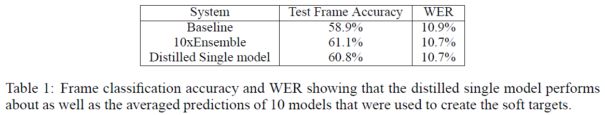
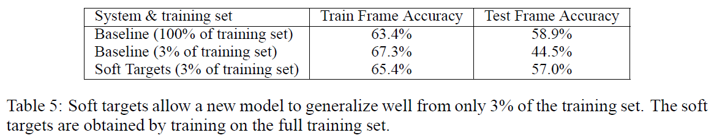

# Distilling the Knowledge in a Neural Network
## Information
- 2014 NIPS Deep Learning Workshop
- Hinton, Geoffrey, Oriol Vinyals, and Jeff Dean. 

## Keywords
- Knowledge Distillation
- Model Compression

## Contribution
- Propose a distillation method that transfers the knowledge from the cumbersome model to a small model that is more suitable for deployment.

## Summary
- An obvious way to transfer the generalization ability of the cumbersome model to a small model is to use the class probabilities produced by the cumbersome model as "**soft targets**" for training the small model.
- When the soft targets have high entropy, they providemuch more information per training case than hard targets and much less variance in the gradient between training cases, so the small model can often be trained on much less data than the original cumbersome model and using a much higher learning rate.
- Distillation:
	- 
	, where zi is the logit(the input to the final softmax) and T is a temperature that is normally set to 1. Using a higher value for T produces a softer probability distribution over classes.
	- Method:
		- Knowledge is transferred to the distilled model by training it on a transfer set and using a soft target distribution for each case in the transfer set that is produced by using the cumbersome model with a high temperature in its softmax.
		- The same high temperature is used when training the distilled model, but after it has been trained it uses a temperature of 1.
	- Joint Training:
		- Also training the distilled model to produce the correct labels can significantly improve this method.
		- Use a weighted average of two different objective function:
			1. The cross entropy with the soft targets and this cross entropy is computed using the same high temperature in the softmax of the distilled model as was used for generating the soft targets from the cumbersome model.
			2. The cross entropy with the correct labels. This is computed using exactly the same logits in softmax of the distilled model but at a temperature of 1.
		- The best results were generally obtained by using a condiderably lower weight on the second objective function.
		- Since the magnitudes of the gradients produced by the soft targets scale as 1/T2, it is important to multiply them by T2 when using both hard and soft targets.
		- This ensures that the relative contributions of the hard and soft targets remain roughly unchanged if the temperature used for distillation is changed while experimenting with meta-parameters.

- Results:
	- Experiments on speech recognition:
		- 
	- Experiments of Soft Targets as Regularizers:
		- 

## Source Code
- [knowledge-distillation-pytorch](https://github.com/peterliht/knowledge-distillation-pytorch)
- [Knowledge distillation with Keras](https://github.com/TropComplique/knowledge-distillation-keras)