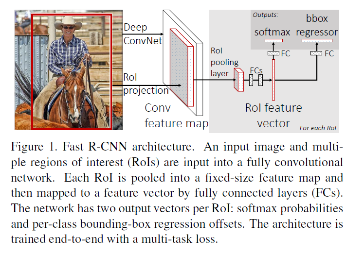
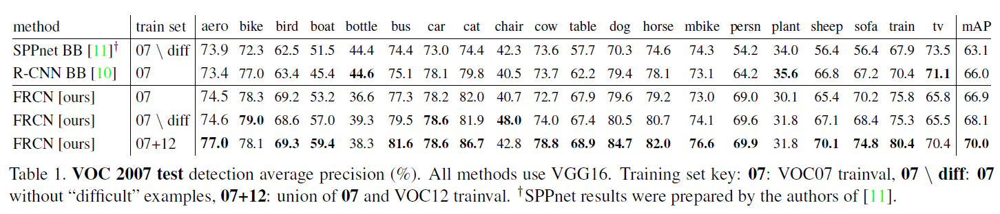
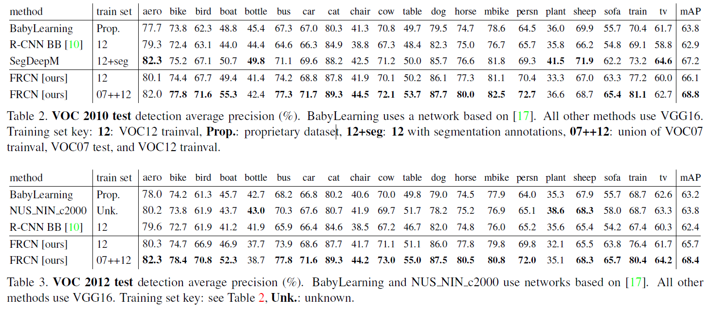

# Fast R-CNN
## Information
- 2015 ICCV
- Girshick, Ross. 

## Keywords
- Object Detection

## Contribution
- Fast R-CNN employs several innovations to improve training and testing speed while also increasing detection accuracy.

## Summary
- Propose a new training algorithm that fixes the disadvantages of R-CNN and SPPnet.
	1. R-CNN disadvantage: R-CNN is slow because it performs a ConvNet forward pass for each object proposal, without sharing computation.
	2. SPPnet cannot update the convolutional layers that precede the spatial pyramid pooling.

- Model Architecture:

	- Input: 
		1. An entire image
		2. A set of object proposals
	- CNN: 
		Processes the whole image with several convolutional (conv) and max pooling layers to produce a conv feature map.
	- Region of Interest(RoI) pooling layer:
		For each object proposal a RoI pooling layer extracts a fixed-length feature vector from the feature map.
	- Fully Connected layers + two sibling output:
		1. Softmax over K+1 categories
		2. Category-specific bounding-box regressors

- Initializing and transforming from pretrained network(ImageNet):
	1. The last max pooling layer is replaced by a RoI pooling layer that is configured by setting H and W to be compatible with the net's first fully connected layer.
	2. The network's last fully connected layer and softmax(which were trained for 1000-way ImageNet classification) are replaced with the two sibling layers described earlier.
	3. Network is modified to take two data inputs: a list of images and a list of RoIs in those images.

- Results:
	- Results on VOC 2007 test:
		
	- Results on VOC 2010 test:
		

## Source Code
- [fast-rcnn](https://github.com/rbgirshick/fast-rcnn)