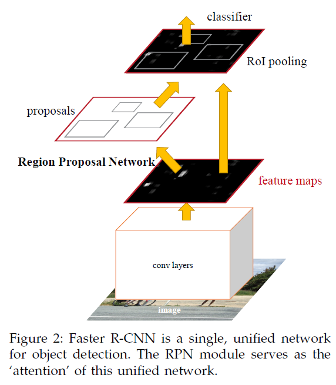
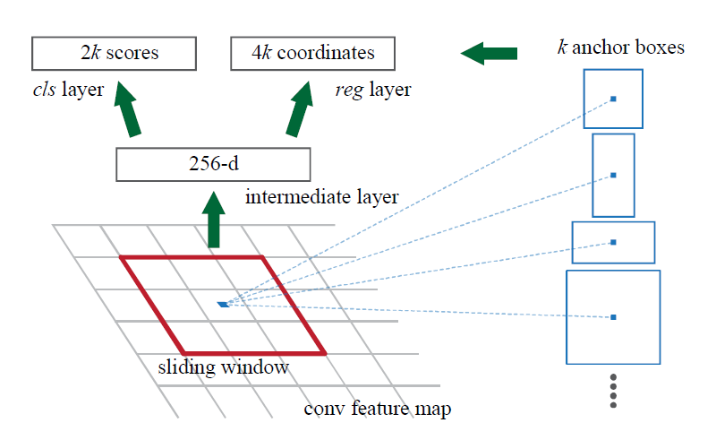
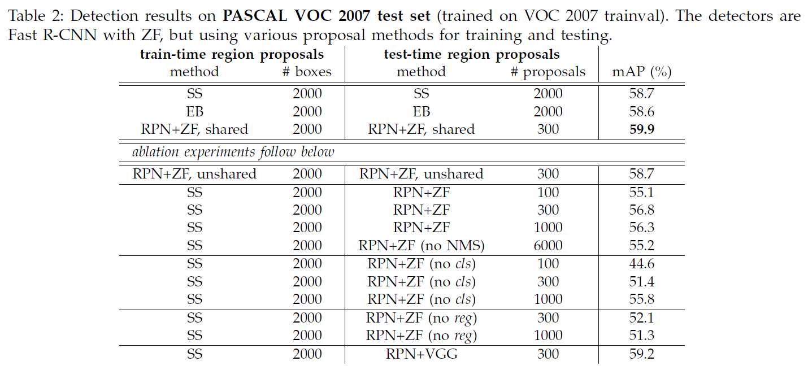
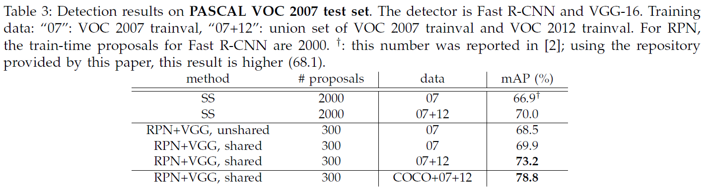
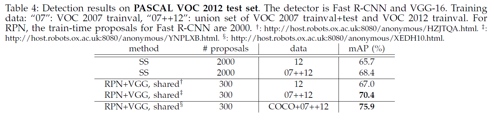

# Faster r-cnn: Towards real-time object detection with region proposal networks
## Information
- 2015 NIPS
- Ren, Shaoqing, et al. 

## Keywords
- Object Detection

## Contribution
- Introduce a Region Proposal Network (RPN) that shares full-image convolutional features with the detection network, thus enabling nearly cost-free region proposals.
- Merge RPN and Fast R-CNN into a single network by sharing their convolutional features.

## Summary
- Merge RPN and Fast R-CNN into a single network by sharing their convolutional features using the recently popular terminology of neural networks with "attention" mechanisms, the RPN component tells the unified network where to look.

- Model Architecture:
	
	1. Region Proposal Networks(RPN):
		
		- The first module is a deep fully convolutional network that proposes regions.
		- A Region Proposal Network (RPN) takes an image(of any size) as input and outputs a set of rectangular object proposals, each with an objectness score.
	2. Fast R-CNN:
		The second module is the Fast R-CNN detector that uses the proposed regions.

- Training: 4-Step Alternating Training
	- Propose a training scheme that alternates between fine-tuning for the region proposal task and then fine-tuning for object detection, while keeping the proposals fixed.
	1. Train the RPN:
		- Initialized with an ImageNet-pre-trained model
		- Fine-tuned end-to-end for the region proposal task
	2. Train a separate detection network by Fast R-CNN
		- Using the proposals generated by the last step RPN
		- Also initialized by the ImageNet pre-trained model
	3. Train the RPN:
		- Use the detector network to initialize RPN training
		- Fix the shared convolutional layers and only fine-tune the layers unique to RPN
		- Now the two networks share convolutional layers.
	4. 	Train Fast R-CNN:
		- Keeping the shared convolutional layers fixed
		- Fine-tune the unique layers of Fast R-CNN

- Results:
	- Results on PASCAL VOC 2007 test set with ZF net:
		
	- Results on PASCAL VOC 2007 test set with VGG-16:
		
	- Results on PASCAL VOC 2012 test set with VGG-16:
		

## Source Code
- [faster-rcnn python version](https://github.com/rbgirshick/py-faster-rcnn)
- [faster-rcnn matlab version](https://github.com/shaoqingren/faster_rcnn)