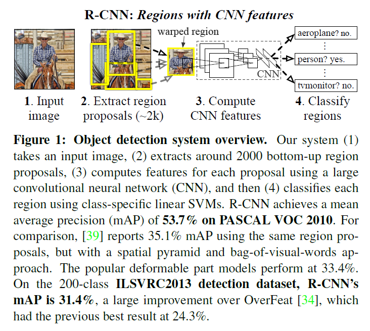
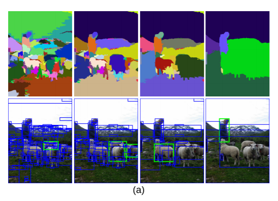
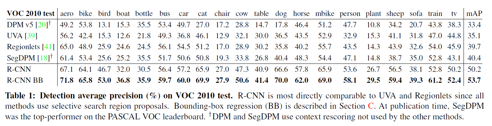
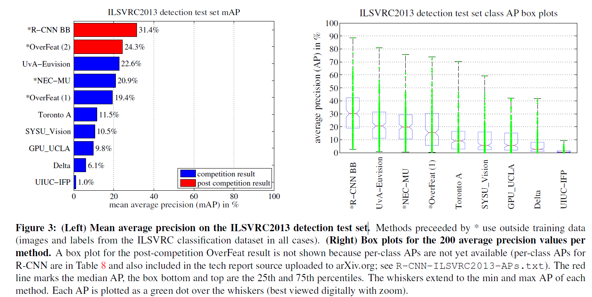

# Rich feature hierarchies for accurate object detection and semantic segmentation(R-CNN)
## Information
- 2014 CVPR
- Girshick, Ross, et al. 

## Keywords
- Object Detection

## Contribution
- First to show that a CNN can lead to dramatically higher object detection performance on PASCAL VOC as compared to systems based on simpler HOG-like features.
- Show that supervised pre-training on a large auxiliary dataset (ILSVRC), followed by domain specific fine-tuning on a small dataset (PASCAL), is an effective paradigm for learning high-capacity CNNs when data is scarce.

## Summary
- R-CNN (Regions with CNN features) localizes objects with a deep network and training a high-capacity model with only a small quantity of annotated detection data.

- Model:
	1. Region Proposals:
		Generates category-independent region proposals. These proposals define the set of candidate detections available to our detector.
		- Selective search:
			1. Hierarchical Grouping Algorithm:
				- 
				1. Create initial regions.
				2. Calculate the similarities between all neighbouring regions.
				3. The two most similar regions are grouped together.
				4. Repeat step2 and step3 until the whole image becomes a single region.
			2. Diversification Strategies:
				Diversify the sampling and create a set of complementary strategies whose locations are combined afterwards.
	2. CNN Feature Extractor:
		A large CNN that extracts a fixed-length feature vector from each region.
		- Extract a 4096-dimensional feature vector from each region proposal using CNN with five convolutional layers and two fully connected layers.
	3. SVM Classifier:
		A set of class specific linear SVMs.
		- Label a region with an IoU overlap threshold, below which regions are defined as negatives.
		- Once features are extracted and training labels are applied, optimize one linear SVM per class.

- Training:
	1. Supervised pre-training:
		- Discriminatively pre-trained the CNN on a large auxiliary dataset(ILSVRC2012 classification) using image-level annotations only(bounding box labels are not available for this data).
	2. Domain-specific fine-tuning
		- To adapt the CNN to the new task(detection) and the new domain(warped proposal windows), continue SGD training of the CNN parameters using only warped region proposals.
		- Treat all region proposals with ≥ 0.5 IoU overlap with a ground-truth box as positives for that box’s class and the rest as negatives.

- Results:
	- Detection average precision (%) on VOC 2010 test:
		
	- Results on ILSVRC2013 detection test set:
		

## Source Code
- [R-CNN](https://github.com/rbgirshick/rcnn)