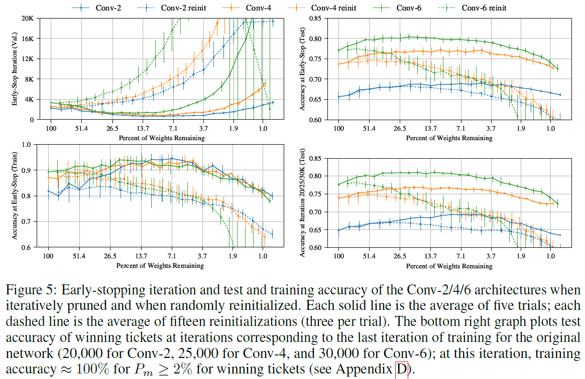

# The Lottery Ticket Hypothesis: Finding Sparse, Trainable Neural Networks
## Information
- 2019 ICLR
- Jonathan Frankle, Michael Carbin 

## Keywords
- Neural Network Pruning

## Contribution
- Demonstrate that pruning uncovers trainable subnetworks that reach test accuracy comparable to the original networks from which they derived in a comparable number of iterations.
- Show that pruning finds winning tickets that learn faster than the original network while reaching higher test accuracy and generalizing better.
- Propose the lottery ticket hypothesis as a new perspective on the composition of neural networks to explain these findings.

## Summary
- Present an algorithm to identify winning tickets and a series of experiments that support the lottery ticket hypothesis and the importance of these fortuitous initializations.
- Show that there consistently exist smaller subnetworks that train from the start and learn at least as fast as their larger counterparts while reaching similar test accuracy.
- Sparse pruning is the only method for finding winning tickets. Although this paper reduces parameter-counts, the resulting architectures are not optimized for modern libraries or hardware.

- **The Lottery Ticket Hypothesis**:
	- A randomly-initialized, dense neural network contains a subnet work that is initialized such that, when trained in isolation, it can match the test accuracy of the original network after training for at most the same number of iterations.
	- When the winning ticket parameters are randomly reinitialized, they no longer match the performance of the original network.
		- Offering evidence that these smaller networks do not train effectively unless they are appropriately initialized.
		- Meaning structure alone cannot explain a winning ticket's success.
	- Identifying winning tickets:
		- Identify a winning ticket by **training a network and pruning its smallest-magnitude weights**.
		1. One-shot Pruning:
			- The network is trained once, p% of weights are pruned, and the surviving weights are reset to their origin initialization.
		2. Iterative Pruning:
			- Repeatedly trains, prunes, and resets the network over n rounds; each round prunes p1/n% of the weights that survive the previous round.

- Results:
	- Winning ticket in Fully-Connected Network:
		- 
		- 
	- Winning ticket in CNN:
		- CNN: 
			
		- CNN with Dropout:
			
	- Winning ticket in VGG and Resnet:
		- VGG-19:
			
		- Resnet-18:
			

## Source Code
- [The Lottery Ticket Hypothesis](https://github.com/google-research/lottery-ticket-hypothesis)
