# Unsupervised Data Augmentation for Consistency Training(UDA)
## Information
- 2019 arXiv
- Xie, Qizhe, et al. 

## Keywords
- Data Augmentation
- Semi-Supervised Learning
- Consistency Training

## Contribution
- Show that state-of-the-art data augmentations found in supervised learning can also serve as a superior source of noise under the consistency enforcing semi-supervised framework.
- Show that Unsupervised Data Augmentation(UDA) can match and even outperform purely supervised learning that uses orders of magnitude more labeled data.
- Show that UDA combines well with transfer learning, e.g., when fine-tuning from BERT, and is effective at high-data regime, e.g. on ImageNet.

## Summary
- Present a new perspective on how to effectively noise unlabeled examples and argue that the quality of noising, specifically those produced by advanced data augmentation methods, plays a crucial role in semi-supervised learning.

- Background:
	- Consistency Training:
		- Consistency training methods simply regularize model predictions to be invariant to small noise applied to either input examples or hidden states.
		- This framework makes sense intuitively because a good model should be robust to any small change in an input example or hidden states.
		- Noise injection methods:
			- Additive Gaussian noise
			- Dropout noise
			- Adversarial noise
	- Supervised Data Augmentation
		- Supervised data augmentation can be equivalently seen as constructing an augmented labeled set from the original supervised set and then training the model on the augmented set.
		- Provides a steady but limited performance boost because these augmentations has so far only been applied to a set of labeled examples which is usually of a small size.

- UDA Model Elements:
	- 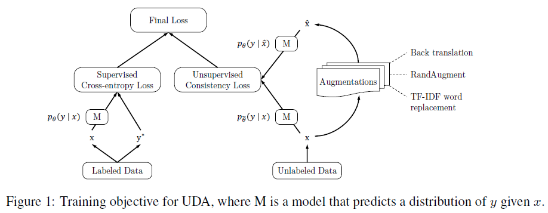
	1. Unsupervised Data Augmentation
		- 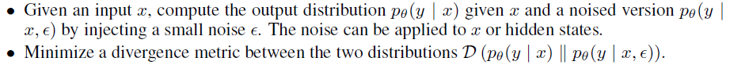
		- Enforces the model to be insensitive to the noise and hence smoother with respect to changes in the input (or hidden) space.
		- Minimizing the consistency loss gradually propagates label information from labeled examples to unlabeled ones.
			- Hypothesize that stronger data augmentations in supervised learning can also lead to superior performance when used to noise unlabeled examples in the semi-supervised consistency training framework.
		- Focus on the unattended question of how the form or quality of the noising operation q can influence the performance of this consistency training framework.
		- Propose to use a rich set of state-of-the-art data augmentations verified in various supervised settings to inject noise and optimize the same consistency training objective on unlabeled examples.
		- Utilize a weighting factor λ to balance the supervised cross entropy and the unsupervised consistency training loss.
			- 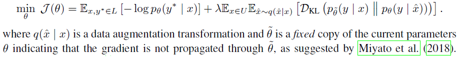
	2. Augmentation Strategies for Different Tasks
		- Intuitions on how more advanced data augmentations can provide extra advantages over simple ones.
			1. Valid noise:
				- Usually generate realistic augmented examples that share the same ground-truth labels with the original example.
				- It is safe to encourage the consistency between predictions on the original unlabeled example and the augmented unlabeled examples.
			2. Diverse noise:
				- Advanced data augmentation can generate a diverse set of examples since it can make large modifications to the input example without changing its label, while simple Gaussian noise only make local changes.
				- Encouraging consistency on a diverse set of augmented examples can significantly improve the sample efficiency.
			3. Targeted inductive biases:
				- Different tasks require different inductive biases. 
				- Data augmentation operations that work well in supervised training essentially provides the missing inductive biases.
		- Augmentation Strategies:
			1. RandAugment for Image Classification
				- Uniformly sample from the same set of augmentation transformations in Python Image Library(PIL).
				- RandAugment is simpler and requires no labeled data as there is no need to search for optimal policies.
			2. Back-translation for Text Classification
				- Translating an existing example x in language A into another language B and then translating it back into A to obtain an augmented example.
				- Back-translation can generate diverse paraphrases while preserving the semantics of the original sentences, leading to significant performance improvements in question answering.
				- Find that the diversity of the paraphrases is more important than the quality or the validity, therefore, employ random sampling with a tunable temperature instead of beam search for the generation.
			3. Word replacing with TF-IDF for Text Classification
				- While back-translation is good at maintaining the global semantics of a sentence, there is little control over which words will be retained.
				- Replaces uninformative words with low TF-IDF scores while keeping those with high TF-IDF values.
	3. Training Signal Annealing (TSA) for Low Data Regime
		- The Semi-supervised learning model often quickly overfits the limited amount of labeled data while still underfitting the unlabeled data.
		- Utilize a labeled example if the model's confidence on that example is lower than a predefined threshold which increases according to a schedule.
		- The threshold serves as a ceiling to prevent over-training on easy labeled examples.
		- The three increasing schedules:
			- 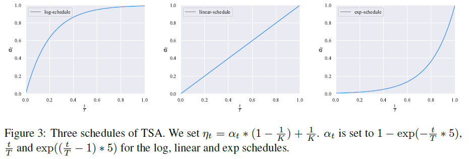

- Experiments:
	- Augmentation's effectiveness between supervised and semi-supervised settings:
		- 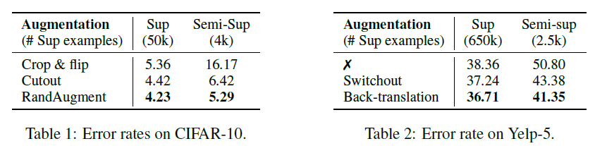
		- Validate the idea of stronger data augmentations found in supervised learning can always lead to more gains when applied to the semi-supervised learning settings.
	- Comparison on Vision Semi-Supervised Learning Benchmarks
		- Vary the size of labeled data
			- 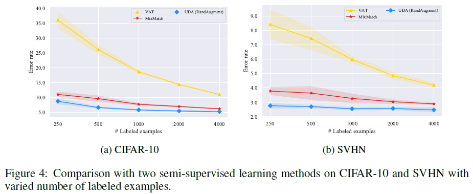
			- Observations:
				1. UDA consistently outperforms the two baselines with a clear margin given different sizes of labeled data.
				2. The performance difference between UDA and VAT shows the superiority of data augmentation based noise.
					- The difference of UDA and VAT is essentially the noise process.
					- While the noise produced by VAT often contain high-frequency artifacts that do not exist in real images, data augmentation mostly generates diverse and realistic images.
		- Comparisons with published results
			- 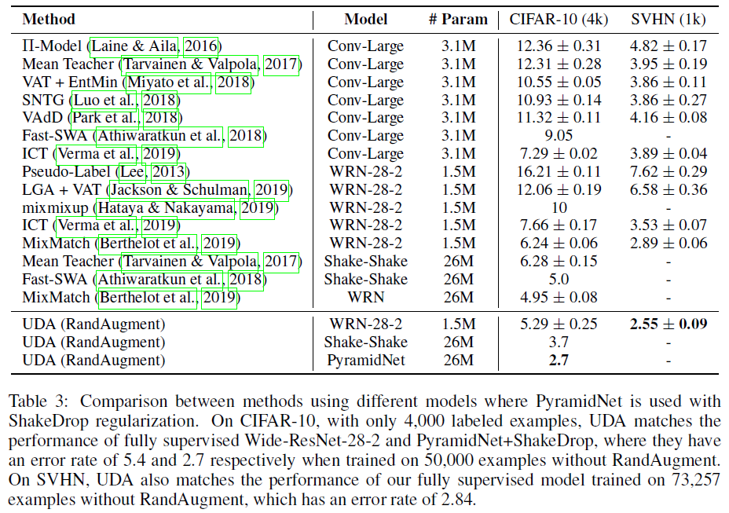
	- Evaluation on Text Classification Datasets
		- Vary the size of labeled data
			- 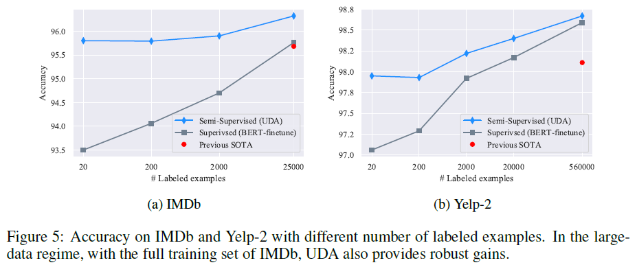
		- Error rates on text classification datasets
			- 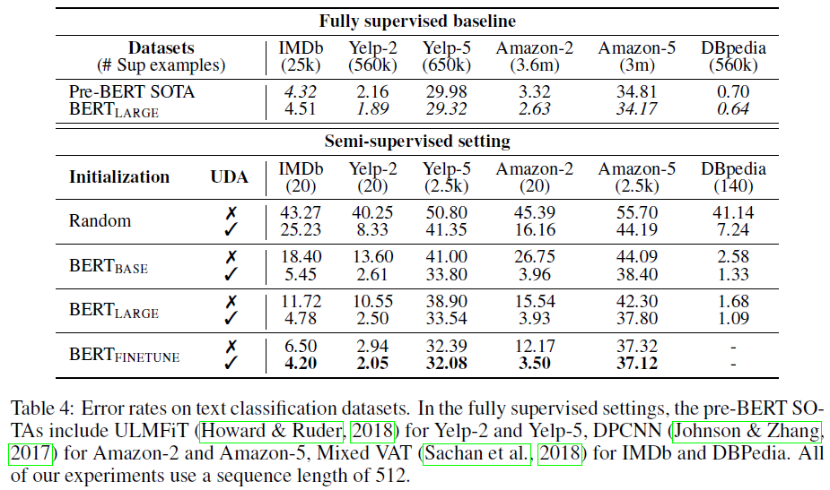
	- Scalability Test:
		- 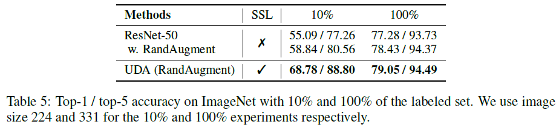
	- The effect of TSA:
		- 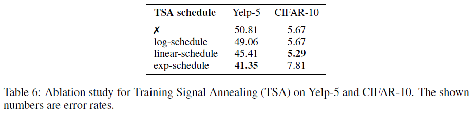

## Source Code
- [UDA](https://github.com/google-research/uda)
