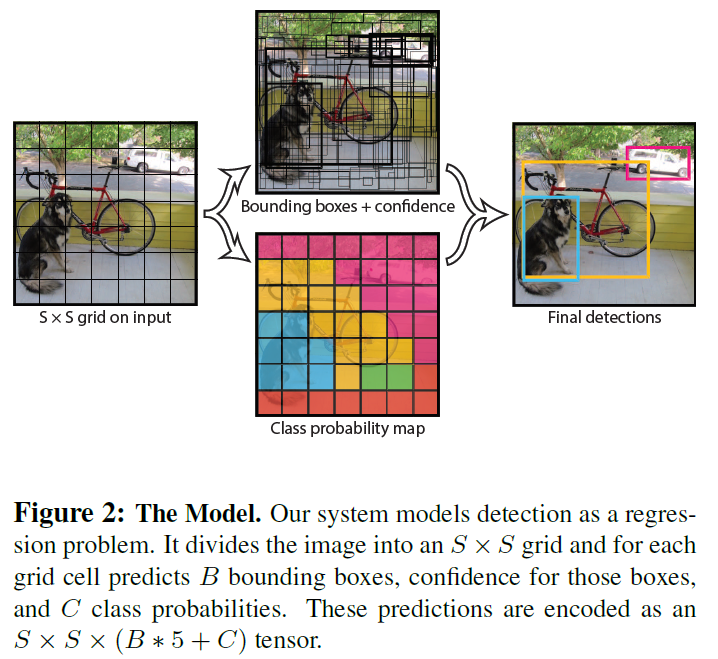
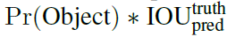
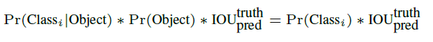
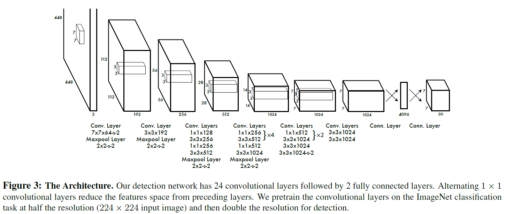
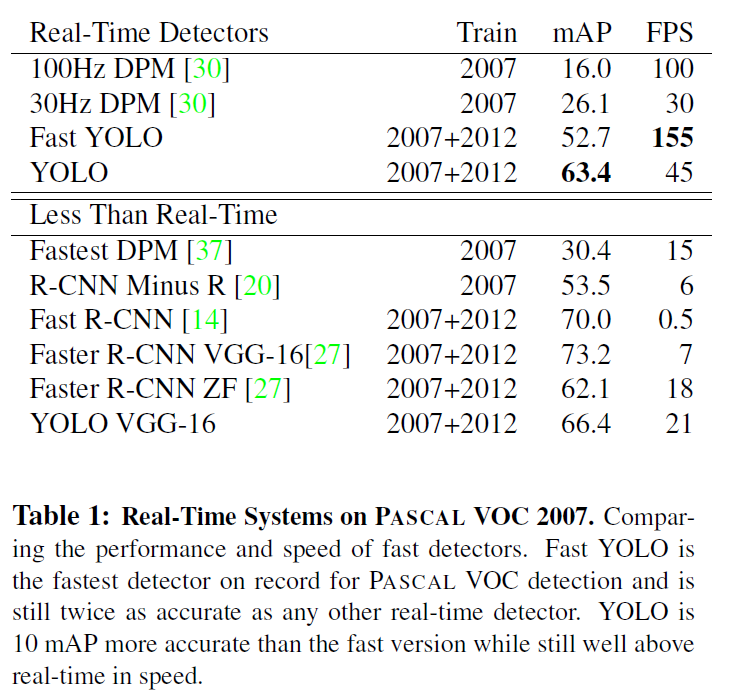

# You Only Look Once: Unified, Real-Time Object Detection(YOLO)
## Information
- 2016 CVPR
- Redmon, Joseph, et al. 

## Keywords
- Object Detection

## Contribution
- Propose a single neural network(YOLO) that predicts bounding boxes and class probabilities directly from full images in one evaluation.

## Summary
- YOLO is a single convolutional network that simultaneously predicts multiple bounding boxes and class probabilities for those boxes. 
- YOLO has sevaral benefits over traditional methods of object detection.
	- YOLO can be optimized end-to-end.
	- YOLO is extremely fast. Simply run the neural network on a new image at test time to predict detections.
	- YOLO sees the entire image during training and test time so it encodes contextual information about classes as well as their appearance.
	- YOLO learns generalizable representations of objects.

- Model Architecture:
	
	- Divides the input image into an SxS grid. If the center of an object falls into a grid cell, that grid cell is responsible for detecting that object.
	- Each grid cell predicts : 
		1. B bounding boxes:
			- Each bounding box consists of 5 predictions: x, y, w, h, and confidence.
			1. (x, y) coordinates represent the center of the box relative to the bounds of the grid cell.
			2. The width and height are predicted relative to the whole image.
			3. The confidence prediction represents the IOU between the predicted box and any ground truth box.
		2. Confidence scores for those boundingboxes. These confidence scores reflect that:
			1. How confident the model is that the box contains an object.
			2. How accurate it thinks the box is that it predicts.
			- The confidence scores:
				
		3. C conditional class probabilities, Pr(Classi|Object):
			- These probabilities are conditioned on the grid cell containing an object.
	- At test time:
		- Multiply the conditional class probabilities and the individual box confidence predictions:
			
			- These scores encode both the probability of that class appearing in the box and how well the predicted box fits the object.
	- Network Design:
		
		- Implement this model as a convolutional neural network

- Drawbacks of YOLO:
	1. Struggle with small objects that appear in groups
		- YOLO imposes strong spatial constraints on bounding box predictions since each grid cell only predicts two boxes and can only have one class.
		- This spatial constraint limits the number of nearby objects that YOLO can predict.
	2. Struggles to generalize to objects in new or unusual aspect ratios or configuration
		- Since YOLO learns to predict bounding boxes from data.
	3. Incorrect localizations
		- Loss function treats errors the same in small bounding boxes versus large bounding boxes.
		- A small error in a large box is generally benign but a small error in a small box has a much greater effect on IOU.

- Results on VOC 2007:
	

## Source Code
- [YOLO](https://pjreddie.com/darknet/yolo/)
